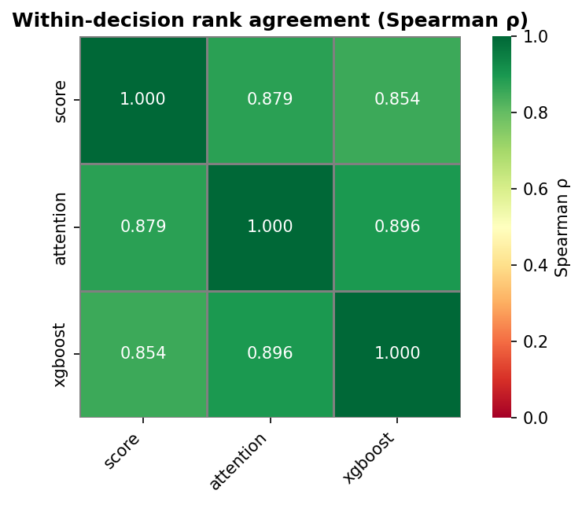
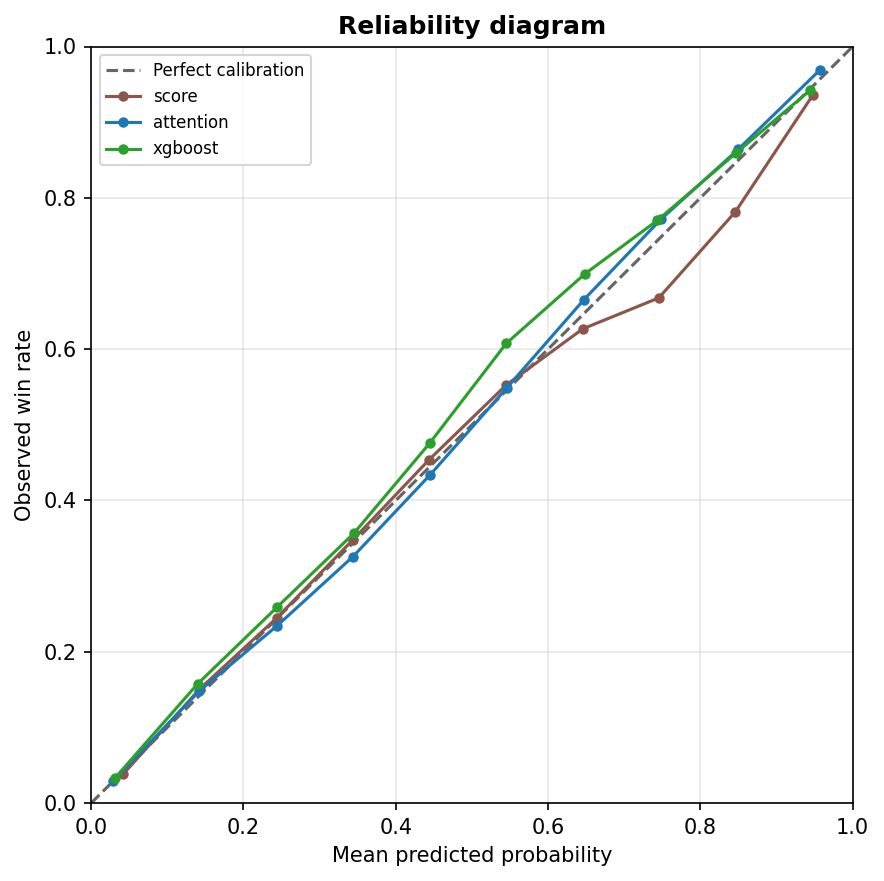
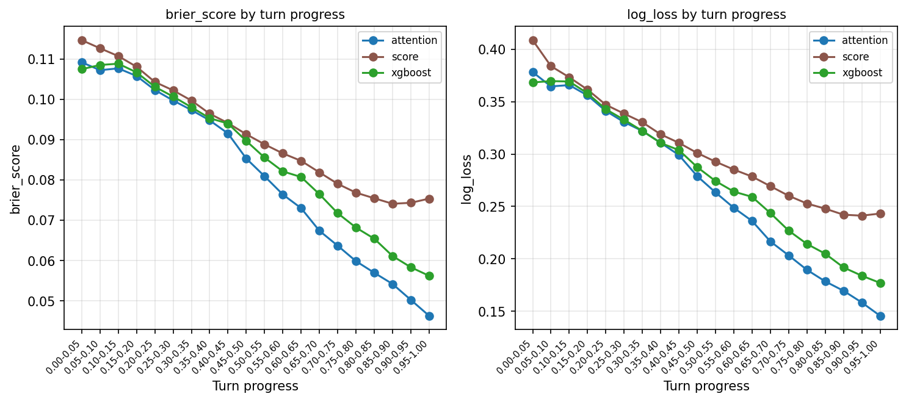
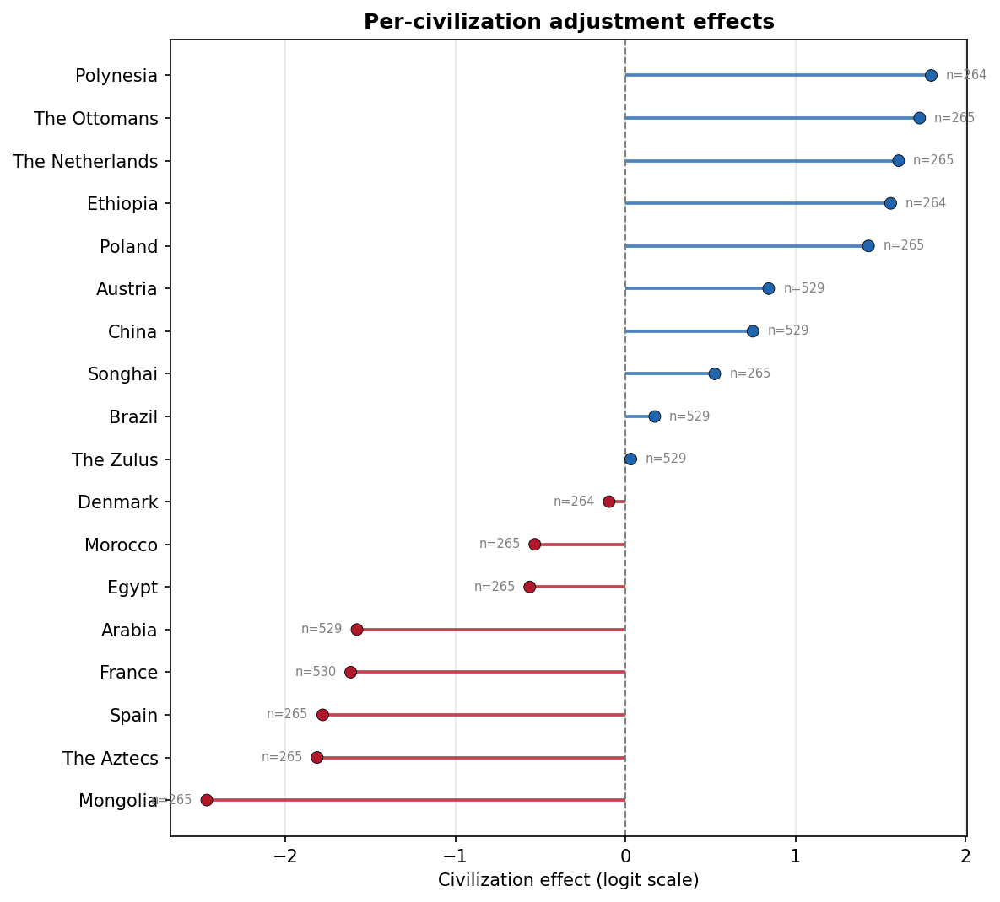

# Controlled CivBench on Vox Populi 5.2.7, Civilization V

*A controlled version of CivBench (Chen et al., 2026). Each LLM strategists rotate through 3 standard maps (8 players), each game features 2 of the same LLM strategists + 6 Vox Populi AI players. Experimented with 2 conditions: having LLMs make a decision every turn (base); having them make a decision every 5 turns, or when an important event comes up (per-5).*

## Which AI makes the best long-term strategist?

Civilization V is a strategy game where you lead a nation from its first village to the space age. A single game takes hundreds of turns, and the winner is often decided by choices made long before the end. That makes it a good test of whether an AI can plan ahead.

**19** AI models · **31** setups tested · **830** games played · **410** turns per game · **3** fixed starts

### Latest news

Leading right now: **GLM-5.3**, deciding every 5 turns, rated **1634**.

> **Latest score · Oct 4, 2026**
>
> **Opus-5.5** scored **1594 Elo** (Per-5, #2).

> **Currently being tested**
>
> **Sonnet-5.5** (every 5 turns) (1/24); **GLM-5.3** (every turn) (1/24); **GPT-6-Astra** (every 5 turns) (8/24); **GPT-6-Luna** (every turn) (23/24); **GPT-6.1-Sol** (every 5 turns) (10/24); **Qwen-3.8-Flash-Next** (every turn) (16/24)

### Who plays best?

Each bar shows how far an AI setup's rating sits above or below the built-in AI, the dashed line.

| # | Player | Deciding | Rating | Likely range |
| ---: | --- | --- | ---: | --- |
| 1 | GLM-5.3 | every 5 turns | 1634 | 1599 to 1668 |
| 2 | Opus-5.5 | every 5 turns | 1594 | 1561 to 1627 |
| 3 | Kimi-K2.7 | every turn | 1575 | 1541 to 1608 |
| 4 | GLM-5.2 | every turn | 1537 | 1503 to 1570 |
| 5 | Kimi-K2.7 | every 5 turns | 1518 | 1484 to 1551 |
| 6 | Qwen-3.8-27B | every turn | 1517 | 1485 to 1550 |
| 7 | GPT-6-Luna | every 5 turns | 1510 | 1476 to 1544 |
| 8 | Kimi-K2.6 | every turn | 1504 | 1471 to 1537 |
| 9 | Built-in AI | - | 1500 | 1491 to 1509 |
| 10 | DeepSeek-V4.1-Flash | every 5 turns | 1496 | 1463 to 1529 |

### What is this built on?

Three pieces of software make these games possible. You do not need to play any of them to read this report.

- **Civilization V**: A 2010 strategy game by Firaxis. You lead a nation through history one turn at a time: building cities, trading, making friends and enemies. [Steam store page](https://store.steampowered.com/app/8930/)
- **Vox Populi**: A large community mod that rebalances Civilization V and makes its computer players much smarter. All games here use version 5.2.7. [Vox Populi on GitHub](https://github.com/LoneGazebo/Community-Patch-DLL)
- **Vox Deorum**: Our open-source bridge that lets an AI agent read the game and steer a nation (through the execution of the built-in AI). [Vox Deorum on GitHub](https://github.com/vox-deorum)
- [Watch any game in the replay viewer](https://vox-deorum.github.io/vox-deorum-replay/)
- [Read the CivBench paper](https://arxiv.org/abs/2604.07733)
- [Read the Vox Deorum paper](https://arxiv.org/abs/2512.18564)

### Key findings

- **Strongest player**: **GLM-5.3** (every 5 turns) is the strongest so far. It beats the built-in AI **68%** of the time head-to-head. [Details](#section-bt-main)
- **Most wins**: **Opus-5.5** (every 5 turns) won **27%** of its games. With 8 players, an even chance would be 1 in 8. [Details](#section-matchup-winrates)
- **How reliable is this?**: Shown a winner and a loser from the same game, our best predictor picks the winner **85%** of the time, well before the game ends. [Details](#section-pred-metrics)
- **Best value**: **GLM-5.3** (every 5 turns) gets the most skill for its price. **Qwen-3.6-27B** (every 5 turns) gets the least. [Details](#section-perf-usage-efficiency)
- **Changed habits**: Against the completed-experiment average, the largest departure is **Qwen-3.6-27B** (every turn) on **waterconnection** (**-31**). [Details](#section-beh-flavors)
- **Diplomacy**: **Friendliest**: **Nemotron-3-Super** (every turn) (+207.4 net) · **Least friendly**: **MiniMax-M3** (every 5 turns) (-37.3 net) · **Most masked**: **DeepSeek-V4-Flash** (every turn) (4.4%) [Details](#section-beh-diplomacy)
- **Ways to win**: Who aims for each kind of win most often. Domination: **Gemma-4** (every turn), 43%; Culture: **MiniMax-M2.7** (every turn), 53%; Diplomacy: **GPT-OSS-120B** (every turn), 51%; Science: **GPT-6-Luna** (every 5 turns), 76%. [Details](#section-beh-commitment)
- **Politics**: **Freedom**: **Kimi-K2.7** (every turn) (29%) · **Autocracy**: **Qwen-3.6-27B** (every turn) (33%) · **Order**: **GPT-6-Luna** (every turn) (67%) [Details](#section-beh-policies)

## Contents

- [Ratings](#family-ratings)
  - [Pairwise skill ratings](#section-bt-main)
  - [Pairwise strategy ratings](#section-bt-strategy)
  - [Adjusted-strength matchups](#section-matchup-strength)
  - [Victory matchups](#section-matchup-winrates)
- [Performance](#family-performance)
  - [Usage, cost, and skill](#section-perf-usage-efficiency)
  - [Win-probability trends](#section-perf-turn-predicted)
  - [Experiment coverage](#section-perf-experiment-completeness)
- [Matched Maps](#family-matched-maps)
  - [Matched Maps](#section-controlled-seed)
- [Behavior](#family-behavior)
  - [Strategic settings](#section-beh-flavors)
  - [Diplomatic behavior](#section-beh-diplomacy)
  - [Strategic commitment](#section-beh-commitment)
  - [Policy paths](#section-beh-policies)
- [Prediction](#family-prediction)
  - [Prediction quality](#section-pred-metrics)
  - [Estimator agreement](#section-pred-compare)
- [Calibration](#family-calibration)
  - [Prediction reliability](#section-cal-reliability)
  - [Prediction error over time](#section-cal-loss-progress)
  - [Civilization strength effects](#section-cal-civ-effects)
  - [Starting-position baselines](#section-cal-cell-baseline)

<a id="family-ratings"></a>
## Ratings

Compare strategists' relative skill across games, using ratings that summarize how consistently they outperform their opponents.

<a id="section-bt-main"></a>
### Pairwise skill ratings

<details>
<summary>Technical details</summary>

*Module: `ratings.bradley_terry`*

*Estimates each player type's relative skill from pairwise comparisons of model-adjusted strength within each game (Bradley-Terry Elo ratings).*

*group_by: player_type; strength_table: strength; adjust_stage: strength; strength_estimator: attention; estimator_model: attention_mlp; estimator_fit: pretrained; estimator_predict: in_sample; adjust_block: auto/start_cell; adjust_turn_progress_min: 0.2; adjust_weight: turn_progress; adjust_enforce_winner: True; adjust_civ_adjust: ols_logit; adjust_baseline_experiment: vanilla-standard-fixed; adjust_post_cell_normalize: none; adjust_cell_gain_bend: 0.5*

</details>

GLM-5.3-Simple-Per-5 leads **33** identities at **1634 Elo**; rating spread: **322** points.

[Figure: bt_main: ratings (interactive HTML)](assets/bt_main/ratings.html)

**Downloads and supporting files**

- [Table: ratings (CSV)](assets/bt_main/ratings.csv)

<a id="section-bt-strategy"></a>
### Pairwise strategy ratings

<details>
<summary>Technical details</summary>

*Module: `ratings.bradley_terry`*

*Estimates relative skill for each player type and strategy combination from pairwise comparisons of model-adjusted strength within each game (Bradley-Terry Elo ratings).*

*group_by: player_type, strategy; strength_table: strength; adjust_stage: strength; strength_estimator: attention; estimator_model: attention_mlp; estimator_fit: pretrained; estimator_predict: in_sample; adjust_block: auto/start_cell; adjust_turn_progress_min: 0.2; adjust_weight: turn_progress; adjust_enforce_winner: True; adjust_civ_adjust: ols_logit; adjust_baseline_experiment: vanilla-standard-fixed; adjust_post_cell_normalize: none; adjust_cell_gain_bend: 0.5*

</details>

Kimi-K2.7-Simple-Culture leads **115** player and condition combinations at **1756 Elo** across **4** groups.

**ratings.bradley_terry strategy ratings**

| Strategist \| Condition | General (all strategies) | Domination | Culture | Diplomatic | Science |
|:---|---:|---:|---:|---:|---:|
| Null | 1311*** | 1366*** |  | 1137*** | 1393* |
| Vanilla | 1500 | 1502 | 1530 | 1502 | 1466 |
| GPT-OSS-120B-Simple \| Every-turn | 1423*** | 1446 | 1306*** | 1451* | 1611** |
| GPT-OSS-120B-Simple \| Per-5 | 1382*** | 1477 | 1341*** | 1290*** | 1429 |
| Opus-5.5-Simple \| Per-5 | 1594*** | 1521 | 1643*** |  | 1534* |
| GLM-5.1-Simple \| Every-turn | 1483 | 1509 | 1416*** | 1093*** | 1723*** |
| GLM-5.2-Simple \| Every-turn | 1537* | 1419** | 1546 |  | 1617*** |
| GLM-5.2-Simple \| Per-5 | 1495 | 1536 | 1507 | 1142*** | 1557** |
| GLM-5.3-Simple \| Per-5 | 1634*** | 1597*** | 1656*** | 1566 | 1661*** |
| GLM-5.3-Flash-Simple \| Every-turn | 1471 | 1446 | 1489 | 1478 | 1480 |
| GLM-5.3-Flash-Simple \| Per-5 | 1435*** | 1446 | 1386*** |  | 1667*** |
| MiniMax-M2.7-Simple \| Every-turn | 1473 | 1480 | 1508 |  | 1418 |
| MiniMax-M2.7-Simple \| Per-5 | 1447** | 1451 | 1434*** |  | 1531 |
| MiniMax-M3-Simple \| Per-5 | 1447** | 1436* | 1466** |  |  |
| Kimi-K2.7-Simple \| Every-turn | 1575*** | 1597* | 1756*** | 1474 | 1552*** |
| Kimi-K2.7-Simple \| Per-5 | 1518 | 1477 | 1548 | 1393** | 1584*** |
| Kimi-K2.6-Simple \| Every-turn | 1504 | 1417* | 1593 | 1628** | 1476 |
| DeepSeek-V4-Flash-Simple \| Every-turn | 1431*** | 1397*** | 1413*** | 964*** | 1552** |
| DeepSeek-V4-Flash-Simple \| Per-5 | 1479 | 1378*** | 1518 | 1627** | 1502 |
| DeepSeek-V4.1-Flash-Simple \| Per-5 | 1496 | 1453 | 1462** | 1431 | 1636*** |
| Qwen-3.5-Simple \| Every-turn | 1460* | 1434* | 1431*** | 1506 | 1572* |
| Qwen-3.5-Simple \| Per-5 | 1424*** | 1468 | 1417*** | 1249*** | 1532 |
| Qwen-3.6-27B-Simple \| Every-turn | 1388*** | 1395*** | 1416*** |  | 1355* |
| Qwen-3.6-27B-Simple \| Per-5 | 1344*** | 1423** | 1322*** |  | 1318*** |
| Qwen-3.8-27B-Simple \| Every-turn | 1517 | 1444 | 1620** | 1553 | 1424 |
| Qwen-3.8-27B-Simple \| Per-5 | 1455** | 1465 | 1470* | 1247*** | 1548** |
| Qwen-3.8-Flash-Next-Simple \| Per-5 | 1495 | 1557 | 1454*** |  | 1623*** |
| Gemma-4-Simple \| Every-turn | 1377*** | 1368*** | 1343*** |  | 1472 |
| Gemma-4-Simple \| Per-5 | 1458* | 1526 | 1354*** |  | 1554** |
| GPT-6-Luna-Simple \| Every-turn | 1476 |  | 1383*** |  | 1504* |
| GPT-6-Luna-Simple \| Per-5 | 1510 | 1553 | 1540 |  | 1516** |
| Nemotron-3-Super-Simple \| Every-turn | 1439*** | 1406** | 1405*** | 1490 | 1546* |
| Nemotron-3-Super-Simple \| Per-5 | 1434*** | 1368*** | 1527 |  | 1429 |

_[full CSV](assets/bt_strategy/strategy_ratings.csv)._

**Downloads and supporting files**

- [Table: ratings (CSV)](assets/bt_strategy/ratings.csv)

<a id="section-matchup-strength"></a>
### Adjusted-strength matchups

<details>
<summary>Technical details</summary>

*Module: `ratings.matchups`*

*Compares every pair of player types using model-adjusted strength, including mean differences and win rates.*

*mode: both; strength_table: strength; adjust_stage: strength; strength_estimator: attention; estimator_model: attention_mlp; estimator_fit: pretrained; estimator_predict: in_sample; adjust_block: auto/start_cell; adjust_turn_progress_min: 0.2; adjust_weight: turn_progress; adjust_enforce_winner: True; adjust_civ_adjust: ols_logit; adjust_baseline_experiment: vanilla-standard-fixed; adjust_post_cell_normalize: none; adjust_cell_gain_bend: 0.5; display: vs_reference*

</details>

GLM-5.3-Simple-Per-5 has the highest observed strength win rate: **66.7%** against VPAI, across **288** player comparisons.

**Win rate**

[Figure: matchup_strength: strength_winrate (interactive HTML)](assets/matchup_strength/strength_winrate.html)

**Mean difference**

[Figure: matchup_strength: strength_mean (interactive HTML)](assets/matchup_strength/strength_mean.html)

**Downloads and supporting files**

- [Table: strength_mean (CSV)](assets/matchup_strength/strength_mean.csv)
- [Table: pvalues_mean (CSV)](assets/matchup_strength/pvalues_mean.csv)
- [Table: strength_winrate (CSV)](assets/matchup_strength/strength_winrate.csv)
- [Table: pvalues_winrate (CSV)](assets/matchup_strength/pvalues_winrate.csv)
- [Table: counts (CSV)](assets/matchup_strength/counts.csv)
- [Table: ols_validation (CSV)](assets/matchup_strength/ols_validation.csv)
- [Table: vs_reference (CSV)](assets/matchup_strength/vs_reference.csv)

<a id="section-matchup-winrates"></a>
### Victory matchups

<details>
<summary>Technical details</summary>

*Module: `ratings.outcome_matchups`*

*Shows wins per player appearance in shared games and final-score margins. The equal-chance victory rate is 1 divided by the number of players in each game (12.5% for eight players).*

*table: panel; include_score_ratio: True; victory_rate_unit: wins per player; expected_win_rate: Equal chance: 1 / full game player count, averaged over player appearances.; p_value_win_rate: Binomial test against equal chance, available for fixed game sizes with one appearance of the player type per game.; display: vs_reference; score_ratio_margin: row minus column*

</details>

Opus-5.5-Simple-Per-5 has the highest per-player matchup victory rate: **27.1%** (**13/48**; expected **12.5%** in 8-player games.)

**Victory rate**

[Figure: matchup_winrates: win_rate (interactive HTML)](assets/matchup_winrates/win_rate.html)

**Score margin**

[Figure: matchup_winrates: score_ratio_margin (interactive HTML)](assets/matchup_winrates/score_ratio_margin.html)

**Downloads and supporting files**

- [Table: win_rate (CSV)](assets/matchup_winrates/win_rate.csv)
- [Table: counts (CSV)](assets/matchup_winrates/counts.csv)
- [Table: expected_win_rate (CSV)](assets/matchup_winrates/expected_win_rate.csv)
- [Table: score_ratio_margin (CSV)](assets/matchup_winrates/score_ratio_margin.csv)
- [Table: vs_reference (CSV)](assets/matchup_winrates/vs_reference.csv)

<a id="family-performance"></a>
## Performance

Compare strategists' strength, progress, cost, and token use, with coverage checks to show which experiments support the results.

<a id="section-perf-usage-efficiency"></a>
### Usage, cost, and skill

<details>
<summary>Technical details</summary>

*Module: `performance.usage_efficiency`*

*Compares cost and token use per player per game with skill, and measures Elo above or below the fitted usage-skill curve.*

*currency: usd; log_x: True; ratings_stage: bt_main; dropped_baselines: 1; unpriced_identities: 0; unrated_identities: 0; cost_basis: per player per complete game; cached_input_estimated: True; efficiency_metric: elo - expected_elo; usage_skill_equation: expected_elo = intercept + slope * log10(average_usage); usage_skill_fits: {'cost': {'intercept': 1443.1448942713625, 'slope': 69.75211722204007, 'n': 31, 'r_squared': 0.3946390744878887}, 'input': {'intercept': 955.5354056284015, 'slope': 74.71487706489961, 'n': 31, 'r_squared': 0.036970011595962915}, 'output': {'intercept': 1238.8477254894897, 'slope': 40.58735497326067, 'n': 31, 'r_squared': 0.09400598573764207}}; baseline_elo: 1500.0; baseline_name: Vanilla; null_baseline_elo: 1311.4972891172015*

</details>

Most cost-efficient: **GLM-5.3-Simple-Per-5** (**+99 Elo** vs the fitted curve). Least cost-efficient: **Qwen-3.6-27B-Simple-Per-5** (**-117 Elo** vs the fitted curve).

[Figure: perf_usage_efficiency: usage_vs_rating (interactive HTML)](assets/perf_usage_efficiency/usage_vs_rating.html)

**Downloads and supporting files**

- [Figure: perf_usage_efficiency: cost (PNG)](assets/perf_usage_efficiency/cost.png)
- [Figure: perf_usage_efficiency: input_tokens (PNG)](assets/perf_usage_efficiency/input_tokens.png)
- [Figure: perf_usage_efficiency: output_tokens (PNG)](assets/perf_usage_efficiency/output_tokens.png)
- [Table: usage (CSV)](assets/perf_usage_efficiency/usage.csv)
- [Table: usage_vs_rating (CSV)](assets/perf_usage_efficiency/usage_vs_rating.csv)

<a id="section-perf-turn-predicted"></a>
### Win-probability trends

<details>
<summary>Technical details</summary>

*Module: `performance.turn_predicted`*

*Shows how each player identity's predicted chance of winning changes from the opening turns through the end of the game.*

*estimator: attention; strength_table: strength; by: player_type; aggregate: mean; games: 794; baseline_experiment: vanilla-standard-fixed*

</details>

Highest mean predicted win probability from **attention**: **GLM-5.3-Simple | Per-5** at **17.7%**. Means range from **6.2%** to **17.7%**.

**Downloads and supporting files**

- [Table: by_identity (CSV)](assets/perf_turn_predicted/by_identity.csv)
- [Table: over_progress (CSV)](assets/perf_turn_predicted/over_progress.csv)
- [Table: over_progress_relative (CSV)](assets/perf_turn_predicted/over_progress_relative.csv)

<a id="section-perf-experiment-completeness"></a>
### Experiment coverage

<details>
<summary>Technical details</summary>

*Module: `performance.experiment_completeness`*

*Reports completed, missing, and repeated games across the planned map, seat, and condition combinations, including decision-turn failures.*

*strength_table: strength; coverage: {'missing_slots': 85, 'repeated_slots': 3, 'failed_decision_turns': 1001, 'excluded_games': 1, 'experiments_with_warnings': 25}; seating: {'files_generated': 6, 'open_cells': 85, 'warnings': []}*

</details>

**830/912** planned games (**91.0%**) are present across **38** experiment(s). **32/38** experiment(s) have every planned game.

**experiment_completeness**

| experiment                               |   required_games |   present_games |   missing_games |   completeness_pct |   repeated_slots |   excluded_games | failed_turn_count   | avg_failure_count   | failure_pct   | warning                                                                                                     |
|:-----------------------------------------|-----------------:|----------------:|----------------:|-------------------:|-----------------:|-----------------:|:--------------------|:--------------------|:--------------|:------------------------------------------------------------------------------------------------------------|
| claude-opus-5.5-standard-fixed-per-5     |               24 |              24 |               0 |             1      |                0 |                0 | 1                   | 0.0208              | 0.0001        | 1 failed decision turn(s)                                                                                   |
| claude-sonnet-5.5-standard-fixed-per-5   |               24 |               1 |              23 |             0.0417 |                0 |                0 | 0                   | 0                   | 0             | 23 missing slot(s); cell repeat counts differ from expected 8                                               |
| deepseek-v4-flash-standard-fixed         |               24 |              24 |               0 |             1      |                0 |                0 | 1                   | 0.0208              | 0.0001        | 1 failed decision turn(s)                                                                                   |
| deepseek-v4-flash-standard-fixed-per-5   |               24 |              24 |               0 |             1      |                0 |                0 | 0                   | 0                   | 0             | ok                                                                                                          |
| deepseek-v4.1-flash-standard-fixed-per-5 |               24 |              24 |               0 |             1      |                0 |                0 | 0                   | 0                   | 0             | ok                                                                                                          |
| gemma-4-standard-fixed                   |               24 |              24 |               0 |             1      |                0 |                0 | 1                   | 0.0208              | 0.0001        | 1 failed decision turn(s)                                                                                   |
| gemma-4-standard-fixed-per-5             |               24 |              24 |               0 |             1      |                0 |                0 | 25                  | 0.5208              | 0.0013        | 25 failed decision turn(s)                                                                                  |
| glm-5.1-standard-fixed                   |               24 |              24 |               0 |             1      |                0 |                0 | 1                   | 0.0208              | 0.0001        | 1 failed decision turn(s)                                                                                   |
| glm-5.2-standard-fixed                   |               24 |              24 |               0 |             1      |                0 |                0 | 60                  | 1.25                | 0.0033        | 60 failed decision turn(s)                                                                                  |
| glm-5.2-standard-fixed-per-5             |               24 |              24 |               0 |             1      |                0 |                0 | 8                   | 0.1667              | 0.0005        | 8 failed decision turn(s)                                                                                   |
| glm-5.3-flash-standard-fixed             |               24 |              24 |               0 |             1      |                0 |                1 | 824                 | 16.48               | 0.0437        | 1 game(s) excluded by decision failure cutoff; 824 failed decision turn(s)                                  |
| glm-5.3-flash-standard-fixed-per-5       |               24 |              24 |               0 |             1      |                0 |                0 | 0                   | 0                   | 0             | ok                                                                                                          |
| glm-5.3-standard-fixed                   |               24 |               1 |              23 |             0.0417 |                0 |                0 | 0                   | 0                   | 0             | 23 missing slot(s); cell repeat counts differ from expected 8                                               |
| glm-5.3-standard-fixed-per-5             |               24 |              24 |               0 |             1      |                0 |                0 | 1                   | 0.0208              | 0.0001        | 1 failed decision turn(s)                                                                                   |
| gpt-6-astra-standard-fixed-per-5         |               24 |               8 |              16 |             0.3333 |                0 |                0 | 0                   | 0                   | 0             | 16 missing slot(s); cell repeat counts differ from expected 8                                               |
| gpt-6-luna-standard-fixed                |               24 |              24 |               1 |             0.9583 |                1 |                0 | 1                   | 0.0208              | 0.0001        | 1 missing slot(s); 1 repeated slot(s); cell repeat counts differ from expected 8; 1 failed decision turn(s) |
| gpt-6-luna-standard-fixed-per-5          |               24 |              24 |               0 |             1      |                0 |                0 | 10                  | 0.2083              | 0.0005        | 10 failed decision turn(s)                                                                                  |
| gpt-6.1-sol-standard-fixed-per-5         |               24 |              10 |              14 |             0.4167 |                0 |                0 | 0                   | 0                   | 0             | 14 missing slot(s); cell repeat counts differ from expected 8                                               |
| kimi-k2.6-standard-fixed                 |               24 |              24 |               0 |             1      |                0 |                0 | 5                   | 0.1042              | 0.0003        | 5 failed decision turn(s)                                                                                   |
| kimi-k2.7-standard-fixed                 |               24 |              24 |               0 |             1      |                0 |                0 | 0                   | 0                   | 0             | ok                                                                                                          |
| kimi-k2.7-standard-fixed-per-5           |               24 |              24 |               0 |             1      |                0 |                0 | 9                   | 0.1875              | 0.0005        | 9 failed decision turn(s)                                                                                   |
| minimax-m2.7-standard-fixed              |               24 |              24 |               0 |             1      |                0 |                0 | 0                   | 0                   | 0             | ok                                                                                                          |
| minimax-m2.7-standard-fixed-per-5        |               24 |              24 |               0 |             1      |                0 |                0 | 3                   | 0.0625              | 0.0002        | 3 failed decision turn(s)                                                                                   |
| minimax-m3-standard-fixed-per-5          |               24 |              24 |               0 |             1      |                0 |                0 | 0                   | 0                   | 0             | ok                                                                                                          |
| nemotron-3-standard-fixed                |               24 |              24 |               0 |             1      |                0 |                0 | 0                   | 0                   | 0             | ok                                                                                                          |
| nemotron-3-standard-fixed-per-5          |               24 |              24 |               0 |             1      |                0 |                0 | 0                   | 0                   | 0             | ok                                                                                                          |
| null-standard-fixed                      |               24 |              24 |               0 |             1      |                0 |                0 |                     |                     |               | decision-turn failure telemetry unavailable                                                                 |
| oss-120b-standard-fixed                  |               24 |              24 |               0 |             1      |                0 |                0 | 35                  | 0.7292              | 0.0019        | 35 failed decision turn(s)                                                                                  |
| oss-120b-standard-fixed-per-5            |               24 |              24 |               0 |             1      |                0 |                0 | 4                   | 0.0833              | 0.0002        | 4 failed decision turn(s)                                                                                   |
| qwen-3.5-standard-fixed                  |               24 |              24 |               0 |             1      |                0 |                0 | 4                   | 0.0833              | 0.0002        | 4 failed decision turn(s)                                                                                   |
| qwen-3.5-standard-fixed-per-5            |               24 |              24 |               0 |             1      |                0 |                0 | 7                   | 0.1458              | 0.0004        | 7 failed decision turn(s)                                                                                   |
| qwen-3.6-27b-standard-fixed              |               24 |              24 |               0 |             1      |                0 |                0 | 0                   | 0                   | 0             | ok                                                                                                          |
| qwen-3.6-27b-standard-fixed-per-5        |               24 |              24 |               0 |             1      |                0 |                0 | 0                   | 0                   | 0             | ok                                                                                                          |
| qwen-3.8-27b-standard-fixed              |               24 |              24 |               0 |             1      |                0 |                0 | 0                   | 0                   | 0             | ok                                                                                                          |
| qwen-3.8-27b-standard-fixed-per-5        |               24 |              24 |               0 |             1      |                0 |                0 | 0                   | 0                   | 0             | ok                                                                                                          |
| qwen-3.8-flash-next-standard-fixed       |               24 |              16 |               8 |             0.6667 |                0 |                0 | 0                   | 0                   | 0             | 8 missing slot(s); cell repeat counts differ from expected 8                                                |
| qwen-3.8-flash-next-standard-fixed-per-5 |               24 |              26 |               0 |             1      |                2 |                0 | 1                   | 0.0192              | 0             | 2 repeated slot(s); cell repeat counts differ from expected 8; 1 failed decision turn(s)                    |
| vanilla-standard-fixed                   |               24 |              24 |               0 |             1      |                0 |                0 | 0                   | 0                   | 0             | ok                                                                                                          |

_[full CSV](assets/perf_experiment_completeness/experiment_completeness.csv)._

**decision_turn_failures**

| experiment                               | game_id                              |   player_id | player_type                      |   valid_turn_count |   failed_turn_count |   failure_pct | failed_turns                                                                                                                                                                                                                                                                                                                                                                                                                                                                                                                                                                                                                                                                                                                                                                                                                                                                                                                                                                                                                                                                                                                                                                                                                                                                                                                                                                                                                                                                                                                                                                                      | excluded_game   |
|:-----------------------------------------|:-------------------------------------|------------:|:---------------------------------|-------------------:|--------------------:|--------------:|:--------------------------------------------------------------------------------------------------------------------------------------------------------------------------------------------------------------------------------------------------------------------------------------------------------------------------------------------------------------------------------------------------------------------------------------------------------------------------------------------------------------------------------------------------------------------------------------------------------------------------------------------------------------------------------------------------------------------------------------------------------------------------------------------------------------------------------------------------------------------------------------------------------------------------------------------------------------------------------------------------------------------------------------------------------------------------------------------------------------------------------------------------------------------------------------------------------------------------------------------------------------------------------------------------------------------------------------------------------------------------------------------------------------------------------------------------------------------------------------------------------------------------------------------------------------------------------------------------|:----------------|
| claude-opus-5.5-standard-fixed-per-5     | d9c10933-49a0-4024-9dda-6ac9a13f8251 |           6 | Opus-5.5-Simple-Per-5            |                431 |                   1 |        0.0023 | 430                                                                                                                                                                                                                                                                                                                                                                                                                                                                                                                                                                                                                                                                                                                                                                                                                                                                                                                                                                                                                                                                                                                                                                                                                                                                                                                                                                                                                                                                                                                                                                                               | False           |
| deepseek-v4-flash-standard-fixed         | 06e0af08-c8e1-4d29-85de-86905fa60bba |           4 | DeepSeek-V4-Flash-Simple         |                378 |                   1 |        0.0026 | 2                                                                                                                                                                                                                                                                                                                                                                                                                                                                                                                                                                                                                                                                                                                                                                                                                                                                                                                                                                                                                                                                                                                                                                                                                                                                                                                                                                                                                                                                                                                                                                                                 | False           |
| gemma-4-standard-fixed                   | 62b7fc17-8534-42cf-86e8-9f7203bc6e31 |           0 | Gemma-4-Simple                   |                333 |                   1 |        0.003  | 0                                                                                                                                                                                                                                                                                                                                                                                                                                                                                                                                                                                                                                                                                                                                                                                                                                                                                                                                                                                                                                                                                                                                                                                                                                                                                                                                                                                                                                                                                                                                                                                                 | False           |
| gemma-4-standard-fixed-per-5             | 49edb947-f249-4166-9cd5-8e275d03d48e |           7 | Gemma-4-Simple-Per-5             |                471 |                   8 |        0.017  | 385,386,387,388,389,390,391,392                                                                                                                                                                                                                                                                                                                                                                                                                                                                                                                                                                                                                                                                                                                                                                                                                                                                                                                                                                                                                                                                                                                                                                                                                                                                                                                                                                                                                                                                                                                                                                   | False           |
| gemma-4-standard-fixed-per-5             | 610e1ec5-92ff-4bf7-be11-418ac59f2380 |           7 | Gemma-4-Simple-Per-5             |                434 |                   5 |        0.0115 | 420,421,422,432,433                                                                                                                                                                                                                                                                                                                                                                                                                                                                                                                                                                                                                                                                                                                                                                                                                                                                                                                                                                                                                                                                                                                                                                                                                                                                                                                                                                                                                                                                                                                                                                               | False           |
| gemma-4-standard-fixed-per-5             | 7d0bcb57-5c0d-45bd-acd6-807d36a3b427 |           6 | Gemma-4-Simple-Per-5             |                343 |                   5 |        0.0146 | 253,254,255,256,328                                                                                                                                                                                                                                                                                                                                                                                                                                                                                                                                                                                                                                                                                                                                                                                                                                                                                                                                                                                                                                                                                                                                                                                                                                                                                                                                                                                                                                                                                                                                                                               | False           |
| gemma-4-standard-fixed-per-5             | 8a02a64e-b1ce-48c5-9285-222c4c6d43a6 |           2 | Gemma-4-Simple-Per-5             |                447 |                   1 |        0.0022 | 446                                                                                                                                                                                                                                                                                                                                                                                                                                                                                                                                                                                                                                                                                                                                                                                                                                                                                                                                                                                                                                                                                                                                                                                                                                                                                                                                                                                                                                                                                                                                                                                               | False           |
| gemma-4-standard-fixed-per-5             | d6267277-576e-438b-9ca9-d93bb2ffe62a |           5 | Gemma-4-Simple-Per-5             |                399 |                   6 |        0.015  | 335,336,352,353,354,355                                                                                                                                                                                                                                                                                                                                                                                                                                                                                                                                                                                                                                                                                                                                                                                                                                                                                                                                                                                                                                                                                                                                                                                                                                                                                                                                                                                                                                                                                                                                                                           | False           |
| glm-5.1-standard-fixed                   | e69a74ca-72b1-4cd8-a76b-4383dbaaef99 |           6 | GLM-5.1-Simple                   |                359 |                   1 |        0.0028 | 2                                                                                                                                                                                                                                                                                                                                                                                                                                                                                                                                                                                                                                                                                                                                                                                                                                                                                                                                                                                                                                                                                                                                                                                                                                                                                                                                                                                                                                                                                                                                                                                                 | False           |
| glm-5.2-standard-fixed                   | 47bafccf-9175-4248-bffc-d7f6ba1df012 |           1 | GLM-5.2-Simple                   |                340 |                  11 |        0.0324 | 283,284,285,286,287,288,289,290,291,292,293                                                                                                                                                                                                                                                                                                                                                                                                                                                                                                                                                                                                                                                                                                                                                                                                                                                                                                                                                                                                                                                                                                                                                                                                                                                                                                                                                                                                                                                                                                                                                       | False           |
| glm-5.2-standard-fixed                   | 47bafccf-9175-4248-bffc-d7f6ba1df012 |           7 | GLM-5.2-Simple                   |                335 |                   9 |        0.0269 | 284,285,286,287,288,289,290,291,292                                                                                                                                                                                                                                                                                                                                                                                                                                                                                                                                                                                                                                                                                                                                                                                                                                                                                                                                                                                                                                                                                                                                                                                                                                                                                                                                                                                                                                                                                                                                                               | False           |
| glm-5.2-standard-fixed                   | 514e26cf-beb1-4dc3-8ddc-a3896e31f6fa |           0 | GLM-5.2-Simple                   |                405 |                   8 |        0.0198 | 337,338,339,340,341,342,343,344                                                                                                                                                                                                                                                                                                                                                                                                                                                                                                                                                                                                                                                                                                                                                                                                                                                                                                                                                                                                                                                                                                                                                                                                                                                                                                                                                                                                                                                                                                                                                                   | False           |
| glm-5.2-standard-fixed                   | 514e26cf-beb1-4dc3-8ddc-a3896e31f6fa |           3 | GLM-5.2-Simple                   |                458 |                   8 |        0.0175 | 336,337,338,339,340,341,342,343                                                                                                                                                                                                                                                                                                                                                                                                                                                                                                                                                                                                                                                                                                                                                                                                                                                                                                                                                                                                                                                                                                                                                                                                                                                                                                                                                                                                                                                                                                                                                                   | False           |
| glm-5.2-standard-fixed                   | 613aa40f-578f-48aa-9f1a-f466b89cc58a |           0 | GLM-5.2-Simple                   |                290 |                   3 |        0.0103 | 0,1,2                                                                                                                                                                                                                                                                                                                                                                                                                                                                                                                                                                                                                                                                                                                                                                                                                                                                                                                                                                                                                                                                                                                                                                                                                                                                                                                                                                                                                                                                                                                                                                                             | False           |
| glm-5.2-standard-fixed                   | 613aa40f-578f-48aa-9f1a-f466b89cc58a |           6 | GLM-5.2-Simple                   |                405 |                   3 |        0.0074 | 0,1,2                                                                                                                                                                                                                                                                                                                                                                                                                                                                                                                                                                                                                                                                                                                                                                                                                                                                                                                                                                                                                                                                                                                                                                                                                                                                                                                                                                                                                                                                                                                                                                                             | False           |
| glm-5.2-standard-fixed                   | efbed03d-88a6-4bc2-b3d9-b9c59cc5d0c1 |           0 | GLM-5.2-Simple                   |                376 |                   8 |        0.0213 | 349,350,351,352,353,354,355,356                                                                                                                                                                                                                                                                                                                                                                                                                                                                                                                                                                                                                                                                                                                                                                                                                                                                                                                                                                                                                                                                                                                                                                                                                                                                                                                                                                                                                                                                                                                                                                   | False           |
| glm-5.2-standard-fixed                   | efbed03d-88a6-4bc2-b3d9-b9c59cc5d0c1 |           3 | GLM-5.2-Simple                   |                375 |                  10 |        0.0267 | 347,348,349,350,351,352,353,354,355,356                                                                                                                                                                                                                                                                                                                                                                                                                                                                                                                                                                                                                                                                                                                                                                                                                                                                                                                                                                                                                                                                                                                                                                                                                                                                                                                                                                                                                                                                                                                                                           | False           |
| glm-5.2-standard-fixed-per-5             | 8deaeceb-3ff5-40d4-b579-49774ab5abdc |           5 | GLM-5.2-Simple-Per-5             |                216 |                   1 |        0.0046 | 210                                                                                                                                                                                                                                                                                                                                                                                                                                                                                                                                                                                                                                                                                                                                                                                                                                                                                                                                                                                                                                                                                                                                                                                                                                                                                                                                                                                                                                                                                                                                                                                               | False           |
| glm-5.2-standard-fixed-per-5             | b6875d19-f75d-4b64-ba01-0d527bef43e1 |           1 | GLM-5.2-Simple-Per-5             |                495 |                   2 |        0.004  | 126,128                                                                                                                                                                                                                                                                                                                                                                                                                                                                                                                                                                                                                                                                                                                                                                                                                                                                                                                                                                                                                                                                                                                                                                                                                                                                                                                                                                                                                                                                                                                                                                                           | False           |
| glm-5.2-standard-fixed-per-5             | b6875d19-f75d-4b64-ba01-0d527bef43e1 |           4 | GLM-5.2-Simple-Per-5             |                246 |                   1 |        0.0041 | 128                                                                                                                                                                                                                                                                                                                                                                                                                                                                                                                                                                                                                                                                                                                                                                                                                                                                                                                                                                                                                                                                                                                                                                                                                                                                                                                                                                                                                                                                                                                                                                                               | False           |
| glm-5.2-standard-fixed-per-5             | d028b800-27d2-4df4-a585-d1837edcb31a |           2 | GLM-5.2-Simple-Per-5             |                221 |                   2 |        0.009  | 134,135                                                                                                                                                                                                                                                                                                                                                                                                                                                                                                                                                                                                                                                                                                                                                                                                                                                                                                                                                                                                                                                                                                                                                                                                                                                                                                                                                                                                                                                                                                                                                                                           | False           |
| glm-5.2-standard-fixed-per-5             | d028b800-27d2-4df4-a585-d1837edcb31a |           3 | GLM-5.2-Simple-Per-5             |                398 |                   2 |        0.005  | 133,134                                                                                                                                                                                                                                                                                                                                                                                                                                                                                                                                                                                                                                                                                                                                                                                                                                                                                                                                                                                                                                                                                                                                                                                                                                                                                                                                                                                                                                                                                                                                                                                           | False           |
| glm-5.3-flash-standard-fixed             | 60e6ccca-a986-4946-ba49-dc511a93eca7 |           1 | VPAI                             |                412 |                 412 |        1      | 0,1,2,3,4,5,6,7,8,9,10,11,12,13,14,15,16,17,18,19,20,21,22,23,24,25,26,27,28,29,30,31,32,33,34,35,36,37,38,39,40,41,42,43,44,45,46,47,48,49,50,51,52,53,54,55,56,57,58,59,60,61,62,63,64,65,66,67,68,69,70,71,72,73,74,75,76,77,78,79,80,81,82,83,84,85,86,87,88,89,90,91,92,93,94,95,96,97,98,99,100,101,102,103,104,105,106,107,108,109,110,111,112,113,114,115,116,117,118,119,120,121,122,123,124,125,126,127,128,129,130,131,132,133,134,135,136,137,138,139,140,141,142,143,144,145,146,147,148,149,150,151,152,153,154,155,156,157,158,159,160,161,162,163,164,165,166,167,168,169,170,171,172,173,174,175,176,177,178,179,180,181,182,183,184,185,186,187,188,189,190,191,192,193,194,195,196,197,198,199,200,201,202,203,204,205,206,207,208,209,210,211,212,213,214,215,216,217,218,219,220,221,222,223,224,225,226,227,228,229,230,231,232,233,234,235,236,237,238,239,240,241,242,243,244,245,246,247,248,249,250,251,252,253,254,255,256,257,258,259,260,261,262,263,264,265,266,267,268,269,270,271,272,273,274,275,276,277,278,279,280,281,282,283,284,285,286,287,288,289,290,291,292,293,294,295,296,297,298,299,300,301,302,303,304,305,306,307,308,309,310,311,312,313,314,315,316,317,318,319,320,321,322,323,324,325,326,327,328,329,330,331,332,333,334,335,336,337,338,339,340,341,342,343,344,345,346,347,348,349,350,351,352,353,354,355,356,357,358,359,360,361,362,363,364,365,366,367,368,369,370,371,372,373,374,375,376,377,378,379,380,381,382,383,384,385,386,387,388,389,390,391,392,393,394,395,396,397,398,399,400,401,402,403,404,405,406,407,408,409,410,411 | True            |
| glm-5.3-flash-standard-fixed             | 60e6ccca-a986-4946-ba49-dc511a93eca7 |           7 | VPAI                             |                412 |                 412 |        1      | 0,1,2,3,4,5,6,7,8,9,10,11,12,13,14,15,16,17,18,19,20,21,22,23,24,25,26,27,28,29,30,31,32,33,34,35,36,37,38,39,40,41,42,43,44,45,46,47,48,49,50,51,52,53,54,55,56,57,58,59,60,61,62,63,64,65,66,67,68,69,70,71,72,73,74,75,76,77,78,79,80,81,82,83,84,85,86,87,88,89,90,91,92,93,94,95,96,97,98,99,100,101,102,103,104,105,106,107,108,109,110,111,112,113,114,115,116,117,118,119,120,121,122,123,124,125,126,127,128,129,130,131,132,133,134,135,136,137,138,139,140,141,142,143,144,145,146,147,148,149,150,151,152,153,154,155,156,157,158,159,160,161,162,163,164,165,166,167,168,169,170,171,172,173,174,175,176,177,178,179,180,181,182,183,184,185,186,187,188,189,190,191,192,193,194,195,196,197,198,199,200,201,202,203,204,205,206,207,208,209,210,211,212,213,214,215,216,217,218,219,220,221,222,223,224,225,226,227,228,229,230,231,232,233,234,235,236,237,238,239,240,241,242,243,244,245,246,247,248,249,250,251,252,253,254,255,256,257,258,259,260,261,262,263,264,265,266,267,268,269,270,271,272,273,274,275,276,277,278,279,280,281,282,283,284,285,286,287,288,289,290,291,292,293,294,295,296,297,298,299,300,301,302,303,304,305,306,307,308,309,310,311,312,313,314,315,316,317,318,319,320,321,322,323,324,325,326,327,328,329,330,331,332,333,334,335,336,337,338,339,340,341,342,343,344,345,346,347,348,349,350,351,352,353,354,355,356,357,358,359,360,361,362,363,364,365,366,367,368,369,370,371,372,373,374,375,376,377,378,379,380,381,382,383,384,385,386,387,388,389,390,391,392,393,394,395,396,397,398,399,400,401,402,403,404,405,406,407,408,409,410,411 | True            |
| glm-5.3-standard-fixed-per-5             | 5d31984a-9921-4529-a71a-2e943dd0747d |           0 | GLM-5.3-Simple-Per-5             |                332 |                   1 |        0.003  | 293                                                                                                                                                                                                                                                                                                                                                                                                                                                                                                                                                                                                                                                                                                                                                                                                                                                                                                                                                                                                                                                                                                                                                                                                                                                                                                                                                                                                                                                                                                                                                                                               | False           |
| gpt-6-luna-standard-fixed                | 2c5b664b-18c5-4033-8900-9c1166a7c627 |           7 | GPT-6-Luna-Simple                |                418 |                   1 |        0.0024 | 417                                                                                                                                                                                                                                                                                                                                                                                                                                                                                                                                                                                                                                                                                                                                                                                                                                                                                                                                                                                                                                                                                                                                                                                                                                                                                                                                                                                                                                                                                                                                                                                               | False           |
| gpt-6-luna-standard-fixed-per-5          | 0632c8cf-46de-4e81-9280-191adbd86095 |           3 | GPT-6-Luna-Simple-Per-5          |                492 |                   1 |        0.002  | 416                                                                                                                                                                                                                                                                                                                                                                                                                                                                                                                                                                                                                                                                                                                                                                                                                                                                                                                                                                                                                                                                                                                                                                                                                                                                                                                                                                                                                                                                                                                                                                                               | False           |
| gpt-6-luna-standard-fixed-per-5          | ed013f54-bfea-4abc-8ac3-1e687e234343 |           1 | GPT-6-Luna-Simple-Per-5          |                496 |                   9 |        0.0181 | 462,464,468,479,480,484,491,493,494                                                                                                                                                                                                                                                                                                                                                                                                                                                                                                                                                                                                                                                                                                                                                                                                                                                                                                                                                                                                                                                                                                                                                                                                                                                                                                                                                                                                                                                                                                                                                               | False           |
| kimi-k2.6-standard-fixed                 | 282c1bf0-8d2a-4c85-b1ae-d57ad2579ab7 |           0 | Kimi-K2.6-Simple                 |                297 |                   2 |        0.0067 | 0,263                                                                                                                                                                                                                                                                                                                                                                                                                                                                                                                                                                                                                                                                                                                                                                                                                                                                                                                                                                                                                                                                                                                                                                                                                                                                                                                                                                                                                                                                                                                                                                                             | False           |
| kimi-k2.6-standard-fixed                 | 375f9a58-250d-4f21-86e2-637d0b2ca0f1 |           3 | Kimi-K2.6-Simple                 |                415 |                   2 |        0.0048 | 249,267                                                                                                                                                                                                                                                                                                                                                                                                                                                                                                                                                                                                                                                                                                                                                                                                                                                                                                                                                                                                                                                                                                                                                                                                                                                                                                                                                                                                                                                                                                                                                                                           | False           |
| kimi-k2.6-standard-fixed                 | c0ac65c1-2231-4d0c-9b82-f8735af18c2b |           1 | Kimi-K2.6-Simple                 |                389 |                   1 |        0.0026 | 225                                                                                                                                                                                                                                                                                                                                                                                                                                                                                                                                                                                                                                                                                                                                                                                                                                                                                                                                                                                                                                                                                                                                                                                                                                                                                                                                                                                                                                                                                                                                                                                               | False           |
| kimi-k2.7-standard-fixed-per-5           | 079be89c-786a-4241-a476-43f25b56a767 |           4 | Kimi-K2.7-Simple-Per-5           |                403 |                   2 |        0.005  | 271,273                                                                                                                                                                                                                                                                                                                                                                                                                                                                                                                                                                                                                                                                                                                                                                                                                                                                                                                                                                                                                                                                                                                                                                                                                                                                                                                                                                                                                                                                                                                                                                                           | False           |
| kimi-k2.7-standard-fixed-per-5           | 2539b221-ce2e-461e-9b1d-6c792becfc09 |           6 | Kimi-K2.7-Simple-Per-5           |                349 |                   2 |        0.0057 | 109,110                                                                                                                                                                                                                                                                                                                                                                                                                                                                                                                                                                                                                                                                                                                                                                                                                                                                                                                                                                                                                                                                                                                                                                                                                                                                                                                                                                                                                                                                                                                                                                                           | False           |
| kimi-k2.7-standard-fixed-per-5           | 2539b221-ce2e-461e-9b1d-6c792becfc09 |           7 | Kimi-K2.7-Simple-Per-5           |                343 |                   2 |        0.0058 | 109,110                                                                                                                                                                                                                                                                                                                                                                                                                                                                                                                                                                                                                                                                                                                                                                                                                                                                                                                                                                                                                                                                                                                                                                                                                                                                                                                                                                                                                                                                                                                                                                                           | False           |
| kimi-k2.7-standard-fixed-per-5           | 7d16f2d7-c8dc-4a74-acdd-3cae1ffcf978 |           6 | Kimi-K2.7-Simple-Per-5           |                447 |                   2 |        0.0045 | 322,323                                                                                                                                                                                                                                                                                                                                                                                                                                                                                                                                                                                                                                                                                                                                                                                                                                                                                                                                                                                                                                                                                                                                                                                                                                                                                                                                                                                                                                                                                                                                                                                           | False           |
| kimi-k2.7-standard-fixed-per-5           | 7d16f2d7-c8dc-4a74-acdd-3cae1ffcf978 |           7 | Kimi-K2.7-Simple-Per-5           |                447 |                   1 |        0.0022 | 323                                                                                                                                                                                                                                                                                                                                                                                                                                                                                                                                                                                                                                                                                                                                                                                                                                                                                                                                                                                                                                                                                                                                                                                                                                                                                                                                                                                                                                                                                                                                                                                               | False           |
| minimax-m2.7-standard-fixed-per-5        | 486c63e5-3e46-4369-bf6b-67721296d31c |           2 | MiniMax-M2.7-Simple-Per-5        |                211 |                   1 |        0.0047 | 102                                                                                                                                                                                                                                                                                                                                                                                                                                                                                                                                                                                                                                                                                                                                                                                                                                                                                                                                                                                                                                                                                                                                                                                                                                                                                                                                                                                                                                                                                                                                                                                               | False           |
| minimax-m2.7-standard-fixed-per-5        | 900c9eba-602a-43a7-a474-6a08a64a162e |           2 | MiniMax-M2.7-Simple-Per-5        |                333 |                   1 |        0.003  | 194                                                                                                                                                                                                                                                                                                                                                                                                                                                                                                                                                                                                                                                                                                                                                                                                                                                                                                                                                                                                                                                                                                                                                                                                                                                                                                                                                                                                                                                                                                                                                                                               | False           |
| minimax-m2.7-standard-fixed-per-5        | 900c9eba-602a-43a7-a474-6a08a64a162e |           5 | MiniMax-M2.7-Simple-Per-5        |                365 |                   1 |        0.0027 | 193                                                                                                                                                                                                                                                                                                                                                                                                                                                                                                                                                                                                                                                                                                                                                                                                                                                                                                                                                                                                                                                                                                                                                                                                                                                                                                                                                                                                                                                                                                                                                                                               | False           |
| oss-120b-standard-fixed                  | 086b973d-c994-43b3-a53f-f592d1b05c3a |           6 | GPT-OSS-120B-Simple              |                477 |                   1 |        0.0021 | 408                                                                                                                                                                                                                                                                                                                                                                                                                                                                                                                                                                                                                                                                                                                                                                                                                                                                                                                                                                                                                                                                                                                                                                                                                                                                                                                                                                                                                                                                                                                                                                                               | False           |
| oss-120b-standard-fixed                  | 2ce17cde-2a99-4d6b-a25b-ef45c1e259eb |           5 | GPT-OSS-120B-Simple              |                463 |                   1 |        0.0022 | 86                                                                                                                                                                                                                                                                                                                                                                                                                                                                                                                                                                                                                                                                                                                                                                                                                                                                                                                                                                                                                                                                                                                                                                                                                                                                                                                                                                                                                                                                                                                                                                                                | False           |
| oss-120b-standard-fixed                  | a960d71e-992a-48e5-9665-055737c7cd5e |           1 | GPT-OSS-120B-Simple              |                445 |                  10 |        0.0225 | 0,1,2,3,4,5,6,171,172,174                                                                                                                                                                                                                                                                                                                                                                                                                                                                                                                                                                                                                                                                                                                                                                                                                                                                                                                                                                                                                                                                                                                                                                                                                                                                                                                                                                                                                                                                                                                                                                         | False           |
| oss-120b-standard-fixed                  | a960d71e-992a-48e5-9665-055737c7cd5e |           7 | GPT-OSS-120B-Simple              |                438 |                   9 |        0.0205 | 0,1,2,3,4,171,173,174,175                                                                                                                                                                                                                                                                                                                                                                                                                                                                                                                                                                                                                                                                                                                                                                                                                                                                                                                                                                                                                                                                                                                                                                                                                                                                                                                                                                                                                                                                                                                                                                         | False           |
| oss-120b-standard-fixed                  | aa20feb7-51b2-4460-9dad-e35551dfedfc |           0 | GPT-OSS-120B-Simple              |                439 |                   5 |        0.0114 | 106,108,109,114,115                                                                                                                                                                                                                                                                                                                                                                                                                                                                                                                                                                                                                                                                                                                                                                                                                                                                                                                                                                                                                                                                                                                                                                                                                                                                                                                                                                                                                                                                                                                                                                               | False           |
| oss-120b-standard-fixed                  | aa20feb7-51b2-4460-9dad-e35551dfedfc |           6 | GPT-OSS-120B-Simple              |                442 |                   9 |        0.0204 | 106,108,109,110,111,112,113,114,115                                                                                                                                                                                                                                                                                                                                                                                                                                                                                                                                                                                                                                                                                                                                                                                                                                                                                                                                                                                                                                                                                                                                                                                                                                                                                                                                                                                                                                                                                                                                                               | False           |
| oss-120b-standard-fixed-per-5            | 02abfd3b-46b7-4282-b74a-2e39c2000eb5 |           3 | GPT-OSS-120B-Simple-Per-5        |                393 |                   2 |        0.0051 | 33,37                                                                                                                                                                                                                                                                                                                                                                                                                                                                                                                                                                                                                                                                                                                                                                                                                                                                                                                                                                                                                                                                                                                                                                                                                                                                                                                                                                                                                                                                                                                                                                                             | False           |
| oss-120b-standard-fixed-per-5            | 03250086-89ee-4ca7-837a-4c3e0b1df300 |           2 | GPT-OSS-120B-Simple-Per-5        |                465 |                   1 |        0.0022 | 274                                                                                                                                                                                                                                                                                                                                                                                                                                                                                                                                                                                                                                                                                                                                                                                                                                                                                                                                                                                                                                                                                                                                                                                                                                                                                                                                                                                                                                                                                                                                                                                               | False           |
| oss-120b-standard-fixed-per-5            | 418730dd-5a04-45ba-a6f2-f2b52f44cd13 |           2 | GPT-OSS-120B-Simple-Per-5        |                418 |                   1 |        0.0024 | 255                                                                                                                                                                                                                                                                                                                                                                                                                                                                                                                                                                                                                                                                                                                                                                                                                                                                                                                                                                                                                                                                                                                                                                                                                                                                                                                                                                                                                                                                                                                                                                                               | False           |
| qwen-3.5-standard-fixed                  | 552f3e20-debf-445e-80a1-518fa80b921b |           1 | Qwen-3.5-Simple                  |                499 |                   4 |        0.008  | 480,481,485,492                                                                                                                                                                                                                                                                                                                                                                                                                                                                                                                                                                                                                                                                                                                                                                                                                                                                                                                                                                                                                                                                                                                                                                                                                                                                                                                                                                                                                                                                                                                                                                                   | False           |
| qwen-3.5-standard-fixed-per-5            | 3b547f7f-651f-4c0f-8586-a9220145fae6 |           6 | Qwen-3.5-Simple-Per-5            |                369 |                   1 |        0.0027 | 0                                                                                                                                                                                                                                                                                                                                                                                                                                                                                                                                                                                                                                                                                                                                                                                                                                                                                                                                                                                                                                                                                                                                                                                                                                                                                                                                                                                                                                                                                                                                                                                                 | False           |
| qwen-3.5-standard-fixed-per-5            | 3b547f7f-651f-4c0f-8586-a9220145fae6 |           7 | Qwen-3.5-Simple-Per-5            |                366 |                   1 |        0.0027 | 0                                                                                                                                                                                                                                                                                                                                                                                                                                                                                                                                                                                                                                                                                                                                                                                                                                                                                                                                                                                                                                                                                                                                                                                                                                                                                                                                                                                                                                                                                                                                                                                                 | False           |
| qwen-3.5-standard-fixed-per-5            | b4dc1a8b-b26d-4ffc-ac3b-108bd2e29d74 |           4 | Qwen-3.5-Simple-Per-5            |                236 |                   2 |        0.0085 | 134,135                                                                                                                                                                                                                                                                                                                                                                                                                                                                                                                                                                                                                                                                                                                                                                                                                                                                                                                                                                                                                                                                                                                                                                                                                                                                                                                                                                                                                                                                                                                                                                                           | False           |
| qwen-3.5-standard-fixed-per-5            | b4dc1a8b-b26d-4ffc-ac3b-108bd2e29d74 |           5 | Qwen-3.5-Simple-Per-5            |                387 |                   2 |        0.0052 | 133,134                                                                                                                                                                                                                                                                                                                                                                                                                                                                                                                                                                                                                                                                                                                                                                                                                                                                                                                                                                                                                                                                                                                                                                                                                                                                                                                                                                                                                                                                                                                                                                                           | False           |
| qwen-3.5-standard-fixed-per-5            | d5a52cd0-adc7-420a-b5e5-de608da25bcb |           5 | Qwen-3.5-Simple-Per-5            |                332 |                   1 |        0.003  | 175                                                                                                                                                                                                                                                                                                                                                                                                                                                                                                                                                                                                                                                                                                                                                                                                                                                                                                                                                                                                                                                                                                                                                                                                                                                                                                                                                                                                                                                                                                                                                                                               | False           |
| qwen-3.8-flash-next-standard-fixed-per-5 | e006cda2-af24-49b4-ab98-8c8e501e4872 |           1 | Qwen-3.8-Flash-Next-Simple-Per-5 |                414 |                   1 |        0.0024 | 179                                                                                                                                                                                                                                                                                                                                                                                                                                                                                                                                                                                                                                                                                                                                                                                                                                                                                                                                                                                                                                                                                                                                                                                                                                                                                                                                                                                                                                                                                                                                                                                               | False           |

_[full CSV](assets/perf_experiment_completeness/decision_turn_failures.csv)._

**Downloads and supporting files**

- [Table: repeated_games (CSV)](assets/perf_experiment_completeness/repeated_games.csv)
- [Table: experiment_completeness_gaps (CSV)](assets/perf_experiment_completeness/experiment_completeness_gaps.csv)
- [Table: cell_repeat_issues (CSV)](assets/perf_experiment_completeness/cell_repeat_issues.csv)
- [Table: condition_progress (CSV)](assets/perf_experiment_completeness/condition_progress.csv)
- [Table: seating_index (CSV)](assets/perf_experiment_completeness/seating_index.csv)
- [claude-sonnet-5.5-standard-fixed-per-5.seating.json](assets/perf_experiment_completeness/seating/claude-sonnet-5.5-standard-fixed-per-5.seating.json)
- [glm-5.3-standard-fixed.seating.json](assets/perf_experiment_completeness/seating/glm-5.3-standard-fixed.seating.json)
- [gpt-6-astra-standard-fixed-per-5.seating.json](assets/perf_experiment_completeness/seating/gpt-6-astra-standard-fixed-per-5.seating.json)
- [gpt-6-luna-standard-fixed.seating.json](assets/perf_experiment_completeness/seating/gpt-6-luna-standard-fixed.seating.json)
- [gpt-6.1-sol-standard-fixed-per-5.seating.json](assets/perf_experiment_completeness/seating/gpt-6.1-sol-standard-fixed-per-5.seating.json)
- [qwen-3.8-flash-next-standard-fixed.seating.json](assets/perf_experiment_completeness/seating/qwen-3.8-flash-next-standard-fixed.seating.json)

<a id="family-matched-maps"></a>
## Matched Maps

Compare strategists and experimental conditions with a VPAI baseline on the same maps and starting positions, so differences in performance can be assessed with the starting setup held constant.

<a id="section-controlled-seed"></a>
### Matched Maps

<details>
<summary>Technical details</summary>

*Module: `performance.controlled_seed_report`*

*Aggregates controlled-seed games by seed and final seat into the tables behind the dedicated controlled-seed HTML report.*

*strategist_order: Null, GPT-OSS-120B-Simple, Opus-5.5-Simple, GLM-5.1-Simple, GLM-5.2-Simple, GLM-5.3-Simple, GLM-5.3-Flash-Simple, MiniMax-M2.7-Simple, MiniMax-M3-Simple, Kimi-K2.7-Simple, Kimi-K2.6-Simple, DeepSeek-V4-Flash-Simple, DeepSeek-V4.1-Flash-Simple, Qwen-3.5-Simple, Qwen-3.6-27B-Simple, Qwen-3.8-27B-Simple, Qwen-3.8-Flash-Next-Simple, Gemma-4-Simple, GPT-6-Luna-Simple, Nemotron-3-Super-Simple; condition_order: Every-turn, Per-5; strategist_colors: {'Vanilla': '#555555', 'Null': '#999999', 'GPT-OSS-120B-Simple': '#FF7F00', 'Opus-5.5-Simple': '#377EB8', 'GLM-5.1-Simple': '#4DAF4A', 'GLM-5.2-Simple': '#4DAF4A', 'GLM-5.3-Simple': '#4DAF4A', 'GLM-5.3-Flash-Simple': '#4DAF4A', 'MiniMax-M2.7-Simple': '#984EA3', 'MiniMax-M3-Simple': '#984EA3', 'Kimi-K2.7-Simple': '#E377C2', 'Kimi-K2.6-Simple': '#E377C2', 'DeepSeek-V4-Flash-Simple': '#8C564B', 'DeepSeek-V4.1-Flash-Simple': '#8C564B', 'Qwen-3.5-Simple': '#E41A1C', 'Qwen-3.6-27B-Simple': '#CB181D', 'Qwen-3.8-27B-Simple': '#CB181D', 'Qwen-3.8-Flash-Next-Simple': '#CB181D', 'Gemma-4-Simple': '#BCBD22', 'GPT-6-Luna-Simple': '#FF6347', 'Nemotron-3-Super-Simple': '#76B900'}; base_label: Every-turn; vanilla_label: Vanilla; focus_order: Domination, Culture, Diplomatic, Science; grid_points: 101; estimator: attention; strength_table: strength; baseline_experiment: vanilla-standard-fixed; has_baseline: True; seeds: 1, 2, 3; player_ids: 0, 1, 2, 3, 4, 5, 6, 7; coverage: {'controlled_games': 794, 'seeds': 3, 'final_seats': 8, 'strategist_condition_combinations': 768, 'unmatched_seed_player_pairs': 0, 'seed_player_pairs_without_predictions': 0, 'notes': []}*

</details>

Strategists exceed VPAI strength in **345/768** matched map-and-seat comparisons (**44.9%**); strength differences range from **-0.497** to **+0.425**.

**Downloads and supporting files**

- [Table: seed_player_summary (CSV)](assets/controlled_seed/seed_player_summary.csv)
- [Table: seed_player_probability (CSV)](assets/controlled_seed/seed_player_probability.csv)
- [Table: seed_player_adjusted (CSV)](assets/controlled_seed/seed_player_adjusted.csv)
- [Table: seed_player_index (CSV)](assets/controlled_seed/seed_player_index.csv)
- [Table: game_player_rank (CSV)](assets/controlled_seed/game_player_rank.csv)
- [Matched-map heatmaps (HTML)](controlled-seed/index.html)

<a id="family-behavior"></a>
## Behavior

Describe how strategists play (military, diplomatic, strategic, and policy choices), against the in-game AI on the same map and seat and in absolute terms.

<a id="section-beh-flavors"></a>
### Strategic settings

<details>
<summary>Technical details</summary>

*Module: `behavior.flavors`*

*Shows how each strategist sets the in-game AI's flavors (0 to 100, 50 is balanced), against the average of completed experiments on the same map and seat and in absolute terms.*

*n_absolute_players: 1492; baseline: completed-experiment average; n_relative_players: 1492; n_unmatched_controlled_players: 0; n_baseline_players: 1444; n_baseline_experiments: 30; flavors: Offense, Defense, CityDefense, Mobilization, MilitaryTraining, Recon, Ranged, Mobile, Nuke, UseNuke, Naval, NavalRecon, Air, Antiair, AirCarrier, Airlift, Expansion, Growth, TileImprovement, Infrastructure, Production, Gold, Science, Culture, Happiness, NavalGrowth, NavalTileImprovement, WaterConnection, GreatPeople, Wonder, Religion, Diplomacy, Espionage, Spaceship*

</details>

Against the completed-experiment average, the largest departure is **Qwen-3.6-27B-Simple | Every-turn** on **waterconnection** (**-31**).

**Relative**

**Relative flavor setting**

| Strategist \| Condition | Off | Def | CDef | Mob | MTrn | Rec | Rng | Mobl | Nuke | UNuk | Nav | NRec | Air | AA | Carr | Lift | Exp | Gro | Tile | Infr | Prod | Gold | Sci | Cul | Hap | NGro | NTile | WCon | GP | Wond | Rel | Dip | Esp | Spc |
|:---|---:|---:|---:|---:|---:|---:|---:|---:|---:|---:|---:|---:|---:|---:|---:|---:|---:|---:|---:|---:|---:|---:|---:|---:|---:|---:|---:|---:|---:|---:|---:|---:|---:|---:|
| Completed-experiment average | 41 | 61 | 59 | 51 | 59 | 45 | 54 | 46 | 35 | 27 | 49 | 40 | 40 | 40 | 27 | 29 | 42 | 66 | 63 | 64 | 76 | 70 | 76 | 65 | 71 | 41 | 39 | 43 | 65 | 44 | 46 | 68 | 53 | 41 |
| GPT-OSS-120B-Simple \| Every-turn | -18 | -23 | -24 | -18 | -20 | +2 | -27 | -17 | -33 | -27 | -4 | -2 | -33 | -35 | -25 | -25 | +15 | +3 | -5 | +6 | +7 | -2 | -5 | +5 | +14 | +9 | 0 | +9 | +17 | +21 | +1 | +20 | +21 | -15 |
| GPT-OSS-120B-Simple \| Per-5 | -12 | -23 | -21 | -9 | -16 | +2 | -20 | -9 | -27 | -19 | 0 | +1 | -23 | -31 | -18 | -18 | +14 | +1 | -4 | +2 | +4 | -4 | -9 | -1 | +9 | +10 | +2 | +5 | +11 | +12 | -6 | +13 | +12 | -14 |
| Opus-5.5-Simple \| Per-5 | -8 | -3 | +2 | -8 | -9 | -25 | +4 | -1 | -8 | -11 | 0 | +2 | +9 | +12 | +19 | +20 | +1 | -5 | -4 | -11 | -12 | -13 | -8 | 0 | -8 | +9 | +12 | +6 | -5 | -1 | -2 | -12 | -2 | +9 |
| GLM-5.1-Simple \| Every-turn | +17 | +16 | +14 | +20 | +20 | +7 | +23 | +18 | +24 | +3 | +13 | +3 | +19 | +16 | -13 | -11 | -10 | +15 | +13 | +16 | +18 | +16 | +15 | +10 | +14 | +4 | 0 | +10 | -2 | -13 | +1 | +14 | +12 | -1 |
| GLM-5.2-Simple \| Every-turn | +6 | +9 | +4 | +11 | +5 | +4 | +5 | +4 | +6 | -2 | +2 | 0 | +3 | +5 | -10 | -7 | +2 | +5 | +9 | +8 | +11 | +12 | +13 | +8 | +11 | -2 | -2 | +2 | +3 | -1 | +6 | +11 | 0 | -3 |
| GLM-5.2-Simple \| Per-5 | +6 | +5 | +2 | +10 | +2 | +6 | +5 | +6 | +16 | +14 | +3 | +5 | +11 | +10 | +11 | +10 | +6 | +2 | +4 | +4 | +7 | +7 | +8 | +3 | +7 | +3 | +5 | +4 | +1 | +7 | +6 | +3 | +2 | +6 |
| GLM-5.3-Simple \| Per-5 | +18 | +4 | 0 | +6 | +6 | +2 | +10 | +11 | +9 | +6 | +14 | +11 | +15 | +13 | +6 | +12 | +5 | -3 | +5 | -3 | -8 | +1 | 0 | +8 | 0 | +9 | +11 | +9 | -2 | +9 | +15 | +1 | +2 | +1 |
| GLM-5.3-Flash-Simple \| Every-turn | +3 | -4 | -5 | -1 | -5 | +3 | +4 | +5 | +5 | +11 | +7 | +10 | +14 | +13 | +23 | +22 | +3 | +2 | -2 | -13 | -18 | -8 | -10 | -4 | -5 | +10 | +11 | +8 | -5 | +3 | +12 | -5 | +3 | +10 |
| GLM-5.3-Flash-Simple \| Per-5 | +3 | -6 | -5 | -2 | -3 | 0 | +3 | +5 | +15 | +19 | +5 | +9 | +13 | +12 | +22 | +20 | +4 | +1 | -3 | -14 | -19 | -12 | -12 | -6 | -10 | +9 | +11 | +7 | -7 | 0 | +7 | -10 | +1 | +9 |
| MiniMax-M2.7-Simple \| Every-turn | +23 | +2 | +7 | +2 | +14 | +7 | +6 | +14 | +11 | +12 | +5 | +11 | +7 | +10 | +22 | +20 | +13 | -14 | -13 | -13 | -11 | -11 | -8 | +7 | -7 | +10 | +11 | +9 | +2 | +8 | +10 | +2 | +22 | +10 |
| MiniMax-M2.7-Simple \| Per-5 | +21 | -4 | -4 | 0 | +7 | +5 | 0 | +11 | +6 | -1 | +5 | +11 | +8 | +10 | +22 | +21 | +17 | -13 | -13 | -13 | -16 | -16 | -15 | +4 | -11 | +8 | +9 | +7 | +2 | +6 | +5 | -3 | +18 | +10 |
| MiniMax-M3-Simple \| Per-5 | +10 | -1 | +1 | +2 | +3 | +9 | +7 | +7 | +16 | +18 | -5 | +3 | -3 | 0 | +10 | +8 | +17 | 0 | -1 | -11 | +2 | -14 | -7 | -2 | -11 | +1 | +2 | -1 | +1 | +13 | +8 | -18 | -8 | -3 |
| Kimi-K2.7-Simple \| Every-turn | -9 | +8 | +7 | +3 | +9 | -2 | +11 | 0 | -1 | -5 | -4 | -5 | +10 | +12 | -19 | -8 | -12 | +7 | +5 | +9 | +13 | +4 | +12 | -8 | +9 | -12 | -14 | -6 | 0 | -19 | -12 | -2 | +3 | +11 |
| Kimi-K2.7-Simple \| Per-5 | -4 | +7 | +7 | +6 | +9 | +1 | +11 | +4 | +7 | -3 | +4 | +3 | +12 | +14 | -15 | -10 | -10 | +11 | +9 | +11 | +12 | +3 | +11 | -3 | +8 | 0 | -2 | +4 | +4 | -11 | -6 | -4 | +8 | +11 |
| Kimi-K2.6-Simple \| Every-turn | -7 | +7 | +6 | +6 | +8 | -2 | +13 | +3 | -2 | -2 | -5 | -4 | +2 | -1 | -15 | -9 | -16 | +9 | +6 | +11 | +13 | +5 | +11 | -8 | +9 | -8 | -9 | -1 | -1 | -20 | -9 | -11 | +1 | +10 |
| DeepSeek-V4-Flash-Simple \| Every-turn | +9 | +2 | 0 | +7 | +2 | +6 | +2 | +5 | +18 | +26 | +5 | +10 | +12 | +11 | +22 | +21 | +8 | -2 | -5 | -7 | -8 | -12 | +2 | -6 | -3 | +10 | +11 | +7 | -8 | +8 | +8 | -8 | 0 | +12 |
| DeepSeek-V4-Flash-Simple \| Per-5 | +8 | -1 | -2 | +5 | 0 | +6 | +2 | +5 | +21 | +30 | +4 | +10 | +10 | +13 | +23 | +21 | +5 | -4 | -5 | -8 | -10 | -13 | 0 | -5 | -7 | +10 | +12 | +7 | -7 | +6 | +8 | -10 | 0 | +13 |
| DeepSeek-V4.1-Flash-Simple \| Per-5 | -7 | +4 | +6 | -1 | +3 | +8 | +8 | +7 | +3 | +9 | +6 | +11 | +12 | +17 | +20 | +20 | -1 | +8 | +11 | +4 | 0 | 0 | +13 | +16 | +8 | +11 | +12 | +8 | +10 | +6 | +17 | +2 | +7 | +11 |
| Qwen-3.5-Simple \| Every-turn | -2 | +2 | +2 | -9 | -1 | 0 | -2 | +5 | -6 | -13 | +1 | +3 | +2 | +1 | -7 | -7 | -1 | +3 | +5 | +6 | -4 | +13 | -4 | +3 | +9 | +3 | +1 | +2 | +10 | +1 | 0 | +10 | +4 | -13 |
| Qwen-3.5-Simple \| Per-5 | +1 | +1 | +2 | -6 | +2 | -2 | +3 | +7 | +6 | +1 | +4 | +7 | +6 | +10 | +11 | +10 | +1 | +1 | +3 | +3 | -7 | +7 | -7 | +3 | +6 | +9 | +9 | +6 | +7 | +8 | +3 | +1 | +4 | -5 |
| Qwen-3.6-27B-Simple \| Every-turn | -7 | 0 | -1 | -1 | -9 | -20 | -12 | -18 | -19 | -22 | -12 | -21 | -26 | -25 | -26 | -27 | -16 | -19 | -15 | -3 | -6 | +8 | -8 | -4 | -15 | -29 | -29 | -31 | -15 | -16 | -24 | -8 | -12 | -25 |
| Qwen-3.6-27B-Simple \| Per-5 | -5 | +1 | +1 | -2 | -8 | -18 | -8 | -13 | -27 | -25 | -10 | -18 | -28 | -26 | -25 | -27 | -12 | -13 | -9 | -1 | -7 | +8 | -5 | -3 | -13 | -23 | -24 | -25 | -14 | -15 | -21 | -15 | -17 | -19 |
| Qwen-3.8-27B-Simple \| Every-turn | -17 | -7 | -8 | -18 | -19 | -9 | -18 | -20 | -23 | -22 | -13 | -23 | -30 | -29 | -25 | -27 | -6 | -1 | -3 | -3 | +3 | +2 | -5 | -3 | -12 | -23 | -23 | -21 | -9 | -11 | -11 | +17 | -21 | -21 |
| Qwen-3.8-27B-Simple \| Per-5 | -18 | -7 | -5 | -15 | -15 | -14 | -12 | -21 | -30 | -24 | -14 | -23 | -32 | -27 | -25 | -27 | -8 | -2 | -4 | -5 | +2 | +1 | -5 | -6 | -12 | -22 | -22 | -23 | -9 | -15 | -13 | +12 | -23 | -20 |
| Qwen-3.8-Flash-Next-Simple \| Per-5 | -25 | -16 | -13 | -23 | -26 | -25 | -18 | -26 | -14 | -19 | -20 | -23 | -18 | -15 | -11 | -11 | -9 | +3 | -2 | -1 | +4 | 0 | -5 | -4 | -9 | -13 | -12 | -8 | +1 | -16 | -9 | +8 | -22 | -12 |
| Gemma-4-Simple \| Every-turn | +23 | +14 | +13 | +31 | +20 | +13 | +9 | +11 | +44 | +47 | +16 | +14 | +25 | +26 | +26 | +22 | -4 | -5 | 0 | +8 | +4 | +11 | +1 | -8 | +3 | +10 | +13 | +7 | -12 | +3 | +6 | -11 | -1 | +9 |
| Gemma-4-Simple \| Per-5 | +21 | +10 | +7 | +24 | +16 | +14 | +7 | +9 | +40 | +40 | +11 | +11 | +25 | +15 | +26 | +22 | +5 | +2 | +3 | +7 | -2 | +4 | -1 | -3 | 0 | +10 | +12 | +6 | -11 | +8 | +8 | -10 | -2 | +10 |
| GPT-6-Luna-Simple \| Every-turn | -27 | +14 | +11 | -16 | +2 | -7 | +11 | +1 | -33 | -26 | -1 | +3 | +33 | +34 | +11 | +13 | -19 | -4 | -1 | -4 | +12 | -14 | +15 | -9 | +4 | +6 | +8 | +4 | +12 | -26 | -6 | +4 | +10 | +34 |
| GPT-6-Luna-Simple \| Per-5 | -24 | +13 | +9 | -14 | +2 | -4 | +10 | +2 | -9 | -3 | -1 | +5 | +25 | +26 | +19 | +18 | -19 | -2 | 0 | -5 | +11 | -15 | +15 | -11 | +3 | +8 | +10 | +6 | +11 | -24 | -1 | +4 | +9 | +36 |
| Nemotron-3-Super-Simple \| Every-turn | -3 | -3 | +1 | 0 | +3 | +15 | -12 | -8 | -27 | -22 | -11 | -12 | -21 | -30 | -20 | -25 | +5 | +6 | +8 | +9 | +10 | +13 | +8 | +15 | +11 | -14 | -12 | -11 | +15 | +24 | -1 | +8 | -10 | -19 |
| Nemotron-3-Super-Simple \| Per-5 | -3 | -6 | -2 | -1 | +2 | +13 | -11 | -5 | -22 | -17 | -7 | -6 | -30 | -35 | -22 | -24 | +6 | +5 | +9 | +7 | +8 | +8 | +6 | +4 | +5 | -8 | -7 | -4 | +11 | +19 | -5 | 0 | -9 | -9 |

_Columns: Off = Offense; Def = Defense; CDef = CityDefense; Mob = Mobilization; MTrn = MilitaryTraining; Rec = Recon; Rng = Ranged; Mobl = Mobile; UNuk = UseNuke; Nav = Naval; NRec = NavalRecon; AA = Antiair; Carr = AirCarrier; Lift = Airlift; Exp = Expansion; Gro = Growth; Tile = TileImprovement; Infr = Infrastructure; Prod = Production; Sci = Science; Cul = Culture; Hap = Happiness; NGro = NavalGrowth; NTile = NavalTileImprovement; WCon = WaterConnection; GP = GreatPeople; Wond = Wonder; Rel = Religion; Dip = Diplomacy; Esp = Espionage; Spc = Spaceship._

_[full CSV](assets/beh_flavors/flavors_relative.csv)._

**Absolute**

**Average flavor setting**

| Strategist \| Condition | Off | Def | CDef | Mob | MTrn | Rec | Rng | Mobl | Nuke | UNuk | Nav | NRec | Air | AA | Carr | Lift | Exp | Gro | Tile | Infr | Prod | Gold | Sci | Cul | Hap | NGro | NTile | WCon | GP | Wond | Rel | Dip | Esp | Spc |
|:---|---:|---:|---:|---:|---:|---:|---:|---:|---:|---:|---:|---:|---:|---:|---:|---:|---:|---:|---:|---:|---:|---:|---:|---:|---:|---:|---:|---:|---:|---:|---:|---:|---:|---:|
| Completed-experiment average | 41 | 61 | 59 | 51 | 59 | 45 | 54 | 46 | 35 | 27 | 49 | 40 | 40 | 40 | 27 | 29 | 42 | 66 | 63 | 64 | 76 | 70 | 76 | 65 | 71 | 41 | 39 | 43 | 65 | 44 | 46 | 68 | 53 | 41 |
| GPT-OSS-120B-Simple \| Every-turn | 22 | 38 | 35 | 32 | 38 | 46 | 26 | 29 | 3 | 1 | 46 | 39 | 7 | 5 | 1 | 3 | 57 | 69 | 58 | 70 | 82 | 69 | 71 | 72 | 85 | 50 | 39 | 52 | 83 | 66 | 47 | 90 | 75 | 26 |
| GPT-OSS-120B-Simple \| Per-5 | 29 | 39 | 38 | 43 | 43 | 46 | 34 | 37 | 7 | 6 | 49 | 41 | 18 | 10 | 9 | 11 | 57 | 66 | 59 | 66 | 80 | 66 | 67 | 64 | 79 | 51 | 41 | 48 | 75 | 56 | 40 | 81 | 65 | 27 |
| Opus-5.5-Simple \| Per-5 | 34 | 58 | 60 | 44 | 50 | 20 | 57 | 46 | 27 | 16 | 49 | 43 | 50 | 52 | 46 | 49 | 43 | 61 | 59 | 53 | 64 | 57 | 67 | 65 | 63 | 50 | 51 | 50 | 60 | 43 | 44 | 56 | 51 | 51 |
| GLM-5.1-Simple \| Every-turn | 59 | 78 | 73 | 72 | 79 | 51 | 76 | 65 | 60 | 32 | 62 | 43 | 59 | 56 | 14 | 17 | 33 | 81 | 77 | 79 | 94 | 86 | 91 | 75 | 85 | 45 | 39 | 53 | 62 | 30 | 47 | 82 | 65 | 40 |
| GLM-5.2-Simple \| Every-turn | 47 | 71 | 63 | 62 | 64 | 48 | 59 | 51 | 42 | 24 | 51 | 40 | 43 | 45 | 17 | 21 | 44 | 71 | 72 | 71 | 87 | 82 | 88 | 73 | 82 | 38 | 38 | 45 | 68 | 43 | 52 | 79 | 53 | 38 |
| GLM-5.2-Simple \| Per-5 | 48 | 66 | 61 | 61 | 61 | 50 | 59 | 53 | 52 | 41 | 52 | 45 | 51 | 50 | 38 | 39 | 49 | 68 | 67 | 67 | 83 | 77 | 84 | 68 | 77 | 44 | 44 | 47 | 66 | 51 | 52 | 71 | 55 | 47 |
| GLM-5.3-Simple \| Per-5 | 59 | 65 | 59 | 58 | 65 | 46 | 64 | 58 | 43 | 32 | 63 | 51 | 55 | 54 | 33 | 40 | 47 | 63 | 68 | 61 | 68 | 71 | 76 | 73 | 71 | 50 | 50 | 53 | 63 | 53 | 61 | 69 | 55 | 42 |
| GLM-5.3-Flash-Simple \| Every-turn | 44 | 58 | 54 | 50 | 54 | 48 | 58 | 51 | 43 | 42 | 57 | 50 | 54 | 53 | 50 | 50 | 45 | 67 | 61 | 51 | 57 | 62 | 65 | 61 | 66 | 51 | 50 | 51 | 60 | 46 | 58 | 63 | 56 | 51 |
| GLM-5.3-Flash-Simple \| Per-5 | 45 | 56 | 54 | 49 | 56 | 45 | 56 | 51 | 50 | 47 | 54 | 49 | 54 | 53 | 49 | 49 | 46 | 67 | 60 | 50 | 56 | 58 | 64 | 59 | 60 | 49 | 50 | 50 | 58 | 44 | 53 | 58 | 54 | 50 |
| MiniMax-M2.7-Simple \| Every-turn | 65 | 63 | 65 | 53 | 73 | 52 | 60 | 61 | 45 | 39 | 54 | 52 | 47 | 50 | 49 | 48 | 55 | 51 | 50 | 50 | 64 | 59 | 68 | 72 | 63 | 51 | 50 | 52 | 67 | 51 | 56 | 70 | 75 | 51 |
| MiniMax-M2.7-Simple \| Per-5 | 62 | 58 | 55 | 52 | 67 | 49 | 54 | 58 | 44 | 30 | 54 | 51 | 48 | 50 | 49 | 50 | 59 | 53 | 50 | 50 | 60 | 54 | 61 | 69 | 59 | 49 | 48 | 50 | 66 | 50 | 51 | 65 | 71 | 52 |
| MiniMax-M3-Simple \| Per-5 | 52 | 60 | 60 | 53 | 62 | 53 | 61 | 53 | 53 | 48 | 44 | 43 | 38 | 41 | 37 | 37 | 59 | 66 | 62 | 53 | 78 | 56 | 68 | 63 | 60 | 41 | 41 | 43 | 65 | 56 | 54 | 50 | 45 | 38 |
| Kimi-K2.7-Simple \| Every-turn | 32 | 69 | 66 | 54 | 68 | 43 | 65 | 46 | 33 | 21 | 45 | 35 | 50 | 52 | 7 | 21 | 30 | 73 | 69 | 73 | 89 | 74 | 88 | 57 | 80 | 28 | 25 | 38 | 65 | 25 | 34 | 65 | 56 | 52 |
| Kimi-K2.7-Simple \| Per-5 | 37 | 68 | 66 | 57 | 68 | 46 | 65 | 51 | 41 | 22 | 52 | 44 | 52 | 54 | 12 | 19 | 32 | 77 | 72 | 75 | 87 | 73 | 87 | 62 | 78 | 41 | 37 | 48 | 69 | 33 | 40 | 64 | 61 | 53 |
| Kimi-K2.6-Simple \| Every-turn | 35 | 68 | 65 | 57 | 67 | 43 | 66 | 50 | 32 | 23 | 44 | 36 | 42 | 39 | 12 | 20 | 26 | 75 | 69 | 74 | 88 | 75 | 87 | 57 | 79 | 33 | 30 | 43 | 64 | 24 | 37 | 57 | 54 | 51 |
| DeepSeek-V4-Flash-Simple \| Every-turn | 50 | 63 | 58 | 58 | 62 | 50 | 55 | 52 | 53 | 52 | 54 | 50 | 52 | 52 | 49 | 50 | 50 | 64 | 58 | 57 | 68 | 58 | 77 | 59 | 67 | 51 | 50 | 51 | 57 | 51 | 54 | 60 | 53 | 53 |
| DeepSeek-V4-Flash-Simple \| Per-5 | 50 | 60 | 56 | 56 | 60 | 50 | 56 | 51 | 54 | 55 | 53 | 51 | 51 | 53 | 50 | 50 | 48 | 61 | 58 | 56 | 65 | 57 | 75 | 61 | 64 | 51 | 51 | 51 | 58 | 50 | 54 | 57 | 53 | 54 |
| DeepSeek-V4.1-Flash-Simple \| Per-5 | 35 | 65 | 65 | 50 | 62 | 52 | 61 | 54 | 38 | 34 | 55 | 51 | 52 | 57 | 47 | 48 | 42 | 74 | 74 | 68 | 75 | 71 | 89 | 81 | 78 | 51 | 52 | 52 | 75 | 49 | 63 | 70 | 60 | 52 |
| Qwen-3.5-Simple \| Every-turn | 40 | 63 | 61 | 42 | 58 | 45 | 51 | 51 | 31 | 16 | 50 | 43 | 43 | 41 | 20 | 21 | 41 | 69 | 68 | 70 | 71 | 83 | 71 | 68 | 80 | 44 | 41 | 45 | 75 | 45 | 46 | 78 | 57 | 28 |
| Qwen-3.5-Simple \| Per-5 | 42 | 62 | 61 | 45 | 60 | 43 | 56 | 53 | 42 | 30 | 53 | 47 | 46 | 50 | 38 | 39 | 43 | 67 | 66 | 66 | 68 | 77 | 69 | 69 | 77 | 49 | 48 | 49 | 73 | 53 | 49 | 69 | 57 | 36 |
| Qwen-3.6-27B-Simple \| Every-turn | 35 | 61 | 58 | 51 | 50 | 25 | 41 | 29 | 17 | 6 | 37 | 20 | 14 | 16 | 1 | 2 | 27 | 47 | 48 | 60 | 69 | 79 | 68 | 61 | 55 | 11 | 10 | 12 | 50 | 28 | 22 | 60 | 41 | 16 |
| Qwen-3.6-27B-Simple \| Per-5 | 36 | 62 | 60 | 50 | 52 | 27 | 45 | 33 | 11 | 4 | 39 | 22 | 12 | 15 | 2 | 2 | 30 | 53 | 54 | 62 | 69 | 79 | 70 | 62 | 58 | 18 | 15 | 19 | 51 | 29 | 25 | 53 | 37 | 22 |
| Qwen-3.8-27B-Simple \| Every-turn | 24 | 54 | 51 | 33 | 41 | 36 | 36 | 26 | 8 | 1 | 36 | 18 | 10 | 11 | 1 | 1 | 36 | 65 | 60 | 61 | 79 | 73 | 70 | 62 | 58 | 17 | 16 | 23 | 56 | 32 | 35 | 85 | 32 | 20 |
| Qwen-3.8-27B-Simple \| Per-5 | 24 | 55 | 54 | 36 | 44 | 30 | 42 | 26 | 3 | 1 | 35 | 17 | 7 | 13 | 1 | 1 | 34 | 64 | 59 | 59 | 77 | 72 | 70 | 59 | 59 | 19 | 17 | 20 | 55 | 29 | 33 | 80 | 30 | 21 |
| Qwen-3.8-Flash-Next-Simple \| Per-5 | 17 | 46 | 46 | 28 | 34 | 20 | 35 | 21 | 21 | 8 | 29 | 18 | 22 | 26 | 15 | 17 | 34 | 69 | 61 | 63 | 79 | 70 | 70 | 61 | 61 | 28 | 27 | 36 | 66 | 27 | 36 | 76 | 31 | 29 |
| Gemma-4-Simple \| Every-turn | 65 | 75 | 71 | 82 | 79 | 57 | 62 | 58 | 77 | 73 | 65 | 54 | 65 | 66 | 53 | 51 | 38 | 61 | 63 | 71 | 80 | 81 | 77 | 57 | 74 | 51 | 52 | 50 | 53 | 47 | 52 | 57 | 52 | 50 |
| Gemma-4-Simple \| Per-5 | 62 | 71 | 66 | 75 | 76 | 59 | 60 | 56 | 75 | 68 | 60 | 51 | 66 | 56 | 53 | 51 | 47 | 68 | 67 | 70 | 73 | 74 | 75 | 62 | 71 | 51 | 52 | 50 | 54 | 52 | 54 | 57 | 51 | 51 |
| GPT-6-Luna-Simple \| Every-turn | 15 | 75 | 70 | 36 | 62 | 37 | 65 | 48 | 3 | 2 | 48 | 43 | 72 | 75 | 37 | 41 | 24 | 62 | 62 | 59 | 88 | 56 | 91 | 56 | 75 | 47 | 47 | 47 | 77 | 18 | 40 | 71 | 63 | 75 |
| GPT-6-Luna-Simple \| Per-5 | 17 | 74 | 68 | 37 | 61 | 41 | 63 | 48 | 27 | 25 | 48 | 45 | 65 | 66 | 45 | 47 | 23 | 63 | 63 | 58 | 87 | 55 | 91 | 55 | 73 | 49 | 49 | 49 | 76 | 20 | 45 | 72 | 62 | 78 |
| Nemotron-3-Super-Simple \| Every-turn | 39 | 58 | 59 | 51 | 63 | 59 | 42 | 39 | 5 | 3 | 38 | 28 | 19 | 10 | 7 | 4 | 47 | 72 | 71 | 73 | 86 | 83 | 84 | 80 | 82 | 26 | 27 | 32 | 79 | 68 | 45 | 76 | 43 | 22 |
| Nemotron-3-Super-Simple \| Per-5 | 39 | 55 | 57 | 50 | 61 | 57 | 42 | 41 | 13 | 12 | 41 | 34 | 11 | 5 | 4 | 4 | 48 | 70 | 72 | 70 | 84 | 78 | 82 | 70 | 76 | 32 | 32 | 39 | 75 | 63 | 41 | 68 | 44 | 32 |

_Columns: Off = Offense; Def = Defense; CDef = CityDefense; Mob = Mobilization; MTrn = MilitaryTraining; Rec = Recon; Rng = Ranged; Mobl = Mobile; UNuk = UseNuke; Nav = Naval; NRec = NavalRecon; AA = Antiair; Carr = AirCarrier; Lift = Airlift; Exp = Expansion; Gro = Growth; Tile = TileImprovement; Infr = Infrastructure; Prod = Production; Sci = Science; Cul = Culture; Hap = Happiness; NGro = NavalGrowth; NTile = NavalTileImprovement; WCon = WaterConnection; GP = GreatPeople; Wond = Wonder; Rel = Religion; Dip = Diplomacy; Esp = Espionage; Spc = Spaceship._

_[full CSV](assets/beh_flavors/flavors_absolute.csv)._

**Downloads and supporting files**

- [Table: flavors_by_seed (CSV)](assets/beh_flavors/flavors_by_seed.csv)
- [Table: flavors_by_seat (CSV)](assets/beh_flavors/flavors_by_seat.csv)

<a id="section-beh-diplomacy"></a>
### Diplomatic behavior

<details>
<summary>Technical details</summary>

*Module: `behavior.diplomacy`*

*Describes diplomatic persona traits and the public and private stances strategists set toward rivals, including how often the two conflict.*

*n_absolute_players: 1492; baseline: matched in-game AI; baseline_experiments: vanilla-standard-fixed; n_relative_players: 1492; n_unmatched_controlled_players: 0; n_baseline_players: 192; traits: DiplomaticBalance, Friendliness, WorkWithWillingness, WorkAgainstWillingness, Loyalty, DenounceWillingness, Forgiveness, Meanness, Neediness, Chattiness, DeceptiveBias; rate: per_100_turns*

</details>

**Friendliest**: Nemotron-3-Super-Simple | Every-turn (+207.4 net) · **Least friendly**: MiniMax-M3-Simple | Per-5 (-37.3 net) · **Most masked**: DeepSeek-V4-Flash-Simple | Every-turn (4.4%)

**Relative**

**Relative persona trait**

| Strategist \| Condition | Bal | Frd | With | Agst | Loy | Den | Fgv | Mean | Need | Chat | Dec |
|:---|---:|---:|---:|---:|---:|---:|---:|---:|---:|---:|---:|
| Matched in-game AI | 6.6 | 6.5 | 6.5 | 6.7 | 5.1 | 6.6 | 3.9 | 6.8 | 7.2 | 3.7 | 6.5 |
| GPT-OSS-120B-Simple \| Every-turn | +0.1 | +1.6 | +2.3 | +0.8 | +1.8 | -1.7 | +3.2 | -1.9 | -0.2 | +0.3 | -1.7 |
| GPT-OSS-120B-Simple \| Per-5 | 0.0 | +1.4 | +2.3 | +0.1 | +0.9 | -1.4 | +2.2 | -1.7 | -0.1 | +0.3 | -1.0 |
| Opus-5.5-Simple \| Per-5 | 0.0 | +0.4 | +0.3 | 0.0 | +1.1 | -1.2 | +1.4 | -2.4 | -0.5 | +0.2 | -1.1 |
| GLM-5.1-Simple \| Every-turn | +0.1 | +0.8 | +0.7 | -0.7 | +2.3 | -1.3 | +1.5 | -2.0 | -0.8 | +1.2 | -3.1 |
| GLM-5.2-Simple \| Every-turn | +0.1 | +1.0 | +0.8 | -0.4 | +1.9 | -2.0 | +1.7 | -2.1 | -1.2 | +1.2 | -2.1 |
| GLM-5.2-Simple \| Per-5 | 0.0 | +0.7 | +0.6 | -0.3 | +1.5 | -1.6 | +1.2 | -2.0 | -0.9 | +0.5 | -1.4 |
| GLM-5.3-Simple \| Per-5 | 0.0 | +0.9 | +0.6 | 0.0 | +1.9 | -3.0 | +1.3 | -2.0 | -1.6 | +2.6 | -2.0 |
| GLM-5.3-Flash-Simple \| Every-turn | 0.0 | +0.1 | +0.1 | -0.2 | +0.5 | -1.0 | +0.5 | -1.5 | -0.3 | +0.9 | -1.0 |
| GLM-5.3-Flash-Simple \| Per-5 | 0.0 | +0.2 | 0.0 | 0.0 | +0.4 | -0.6 | +0.6 | -1.2 | -0.3 | +0.3 | -0.6 |
| MiniMax-M2.7-Simple \| Every-turn | 0.0 | +0.5 | +1.3 | +1.3 | +0.8 | +0.7 | +0.2 | -0.5 | -0.5 | +1.2 | -0.7 |
| MiniMax-M2.7-Simple \| Per-5 | 0.0 | +0.1 | +0.7 | +0.6 | +0.7 | +0.7 | 0.0 | -0.2 | -0.3 | +0.5 | -0.5 |
| MiniMax-M3-Simple \| Per-5 | 0.0 | +0.2 | +0.5 | 0.0 | +0.2 | -0.1 | -0.1 | -0.1 | -0.4 | +1.3 | -0.5 |
| Kimi-K2.7-Simple \| Every-turn | +0.1 | +1.1 | +0.7 | -1.3 | +2.2 | -3.1 | +2.5 | -3.2 | -2.6 | +1.5 | -2.8 |
| Kimi-K2.7-Simple \| Per-5 | 0.0 | +0.8 | +0.6 | -0.4 | +1.8 | -2.1 | +1.8 | -2.3 | -2.0 | +1.1 | -2.3 |
| Kimi-K2.6-Simple \| Every-turn | +0.1 | +0.6 | +0.8 | -0.6 | +1.6 | -2.0 | +1.8 | -2.6 | -2.3 | +1.5 | -2.4 |
| DeepSeek-V4-Flash-Simple \| Every-turn | 0.0 | +0.1 | +0.1 | 0.0 | +0.2 | -0.2 | +0.2 | -1.2 | 0.0 | 0.0 | -0.5 |
| DeepSeek-V4-Flash-Simple \| Per-5 | 0.0 | +0.1 | 0.0 | 0.0 | +0.2 | -0.4 | +0.1 | -1.1 | -0.1 | 0.0 | -0.5 |
| DeepSeek-V4.1-Flash-Simple \| Per-5 | 0.0 | +0.6 | +0.3 | -0.3 | +0.7 | -1.7 | +0.7 | -2.1 | -0.4 | +0.1 | -1.3 |
| Qwen-3.5-Simple \| Every-turn | +0.1 | +1.6 | +1.9 | +0.7 | +2.7 | -1.6 | +2.1 | -2.7 | -2.5 | +3.3 | -2.5 |
| Qwen-3.5-Simple \| Per-5 | 0.0 | +1.3 | +1.7 | +0.4 | +2.4 | -1.6 | +2.1 | -2.7 | -2.5 | +2.5 | -2.2 |
| Qwen-3.6-27B-Simple \| Every-turn | +0.1 | +0.2 | +1.1 | +0.6 | +1.3 | -1.6 | +1.9 | -2.2 | -1.6 | +1.2 | -2.0 |
| Qwen-3.6-27B-Simple \| Per-5 | 0.0 | +0.3 | +0.8 | +0.7 | +1.3 | -1.6 | +1.6 | -2.2 | -1.2 | +0.7 | -1.8 |
| Qwen-3.8-27B-Simple \| Every-turn | +0.2 | +1.4 | +2.0 | -0.1 | +2.8 | -2.9 | +3.1 | -3.0 | -1.1 | +2.0 | -2.9 |
| Qwen-3.8-27B-Simple \| Per-5 | 0.0 | +0.9 | +1.6 | -0.1 | +2.8 | -2.9 | +2.5 | -3.0 | -1.1 | +1.8 | -3.1 |
| Qwen-3.8-Flash-Next-Simple \| Per-5 | 0.0 | +0.4 | +1.3 | -0.7 | +1.8 | -3.6 | +1.7 | -3.7 | -1.2 | +4.2 | -2.6 |
| Gemma-4-Simple \| Every-turn | 0.0 | 0.0 | +0.1 | +0.2 | +0.6 | -0.6 | +0.2 | -0.8 | -0.2 | +0.3 | -0.4 |
| Gemma-4-Simple \| Per-5 | 0.0 | -0.1 | +0.1 | +0.1 | +0.2 | -0.1 | +0.2 | -0.7 | -0.2 | 0.0 | -0.1 |
| GPT-6-Luna-Simple \| Every-turn | 0.0 | +1.2 | +2.1 | +0.2 | +2.8 | -2.1 | +2.2 | -3.4 | -1.7 | +0.6 | -2.9 |
| GPT-6-Luna-Simple \| Per-5 | 0.0 | +1.3 | +2.3 | +0.4 | +2.9 | -1.8 | +1.7 | -3.3 | -1.4 | +0.3 | -2.6 |
| Nemotron-3-Super-Simple \| Every-turn | 0.0 | +1.6 | +1.8 | -0.1 | +2.8 | -2.5 | +3.4 | -2.7 | -0.8 | +0.9 | -1.6 |
| Nemotron-3-Super-Simple \| Per-5 | 0.0 | +1.1 | +1.0 | -0.3 | +1.8 | -1.8 | +2.8 | -2.4 | -0.4 | +0.4 | -1.2 |

_Columns: Bal = DiplomaticBalance; Frd = Friendliness; With = WorkWithWillingness; Agst = WorkAgainstWillingness; Loy = Loyalty; Den = DenounceWillingness; Fgv = Forgiveness; Mean = Meanness; Need = Neediness; Chat = Chattiness; Dec = DeceptiveBias._

_[full CSV](assets/beh_diplomacy/diplomacy_relative.csv)._

**Absolute**

**Average persona trait**

| Strategist \| Condition | Bal | Frd | With | Agst | Loy | Den | Fgv | Mean | Need | Chat | Dec |
|:---|---:|---:|---:|---:|---:|---:|---:|---:|---:|---:|---:|
| Matched in-game AI | 6.6 | 6.5 | 6.5 | 6.7 | 5.1 | 6.6 | 3.9 | 6.8 | 7.2 | 3.7 | 6.5 |
| GPT-OSS-120B-Simple \| Every-turn | 7.0 | 8.6 | 9.0 | 7.7 | 7.0 | 5.0 | 7.2 | 4.5 | 7.0 | 3.9 | 5.0 |
| GPT-OSS-120B-Simple \| Per-5 | 6.7 | 8.0 | 8.8 | 6.8 | 6.0 | 5.2 | 6.1 | 5.1 | 7.1 | 4.0 | 5.5 |
| Opus-5.5-Simple \| Per-5 | 6.6 | 7.0 | 6.8 | 6.7 | 6.3 | 5.5 | 5.3 | 4.4 | 6.7 | 4.0 | 5.4 |
| GLM-5.1-Simple \| Every-turn | 6.7 | 7.3 | 7.2 | 6.0 | 7.5 | 5.3 | 5.4 | 4.8 | 6.4 | 4.9 | 3.5 |
| GLM-5.2-Simple \| Every-turn | 6.7 | 7.5 | 7.3 | 6.3 | 7.0 | 4.6 | 5.6 | 4.7 | 6.0 | 5.0 | 4.4 |
| GLM-5.2-Simple \| Per-5 | 6.7 | 7.2 | 7.1 | 6.4 | 6.7 | 5.1 | 5.2 | 4.8 | 6.3 | 4.3 | 5.1 |
| GLM-5.3-Simple \| Per-5 | 6.7 | 7.5 | 7.1 | 6.7 | 7.1 | 3.6 | 5.2 | 4.8 | 5.6 | 6.3 | 4.5 |
| GLM-5.3-Flash-Simple \| Every-turn | 6.7 | 6.7 | 6.7 | 6.4 | 5.5 | 5.6 | 4.5 | 5.4 | 6.9 | 4.7 | 5.6 |
| GLM-5.3-Flash-Simple \| Per-5 | 6.6 | 6.7 | 6.5 | 6.7 | 5.5 | 6.1 | 4.5 | 5.6 | 7.0 | 4.0 | 5.9 |
| MiniMax-M2.7-Simple \| Every-turn | 6.6 | 7.0 | 7.8 | 8.0 | 5.9 | 7.3 | 4.2 | 6.3 | 6.7 | 4.9 | 5.8 |
| MiniMax-M2.7-Simple \| Per-5 | 6.6 | 6.6 | 7.2 | 7.3 | 5.8 | 7.3 | 3.9 | 6.6 | 7.0 | 4.2 | 6.1 |
| MiniMax-M3-Simple \| Per-5 | 6.6 | 6.7 | 7.0 | 6.8 | 5.3 | 6.5 | 3.8 | 6.7 | 6.8 | 5.0 | 6.0 |
| Kimi-K2.7-Simple \| Every-turn | 6.7 | 7.6 | 7.2 | 5.4 | 7.4 | 3.5 | 6.4 | 3.6 | 4.7 | 5.2 | 3.7 |
| Kimi-K2.7-Simple \| Per-5 | 6.7 | 7.3 | 7.1 | 6.3 | 6.9 | 4.6 | 5.7 | 4.6 | 5.2 | 4.8 | 4.2 |
| Kimi-K2.6-Simple \| Every-turn | 6.7 | 7.1 | 7.3 | 6.1 | 6.8 | 4.6 | 5.8 | 4.2 | 4.9 | 5.2 | 4.2 |
| DeepSeek-V4-Flash-Simple \| Every-turn | 6.6 | 6.7 | 6.6 | 6.7 | 5.4 | 6.4 | 4.1 | 5.7 | 7.2 | 3.7 | 6.1 |
| DeepSeek-V4-Flash-Simple \| Per-5 | 6.6 | 6.6 | 6.5 | 6.7 | 5.4 | 6.2 | 4.0 | 5.8 | 7.1 | 3.7 | 6.1 |
| DeepSeek-V4.1-Flash-Simple \| Per-5 | 6.6 | 7.1 | 6.8 | 6.4 | 5.8 | 4.9 | 4.6 | 4.7 | 6.9 | 3.8 | 5.3 |
| Qwen-3.5-Simple \| Every-turn | 6.7 | 8.1 | 8.4 | 7.4 | 7.9 | 5.0 | 6.0 | 4.1 | 4.8 | 7.0 | 4.1 |
| Qwen-3.5-Simple \| Per-5 | 6.7 | 7.7 | 8.0 | 7.2 | 7.4 | 5.1 | 6.1 | 4.2 | 4.9 | 6.2 | 4.4 |
| Qwen-3.6-27B-Simple \| Every-turn | 6.7 | 6.8 | 7.6 | 7.3 | 6.4 | 5.1 | 5.9 | 4.6 | 5.7 | 4.9 | 4.5 |
| Qwen-3.6-27B-Simple \| Per-5 | 6.7 | 6.8 | 7.3 | 7.4 | 6.4 | 5.0 | 5.5 | 4.6 | 6.0 | 4.4 | 4.7 |
| Qwen-3.8-27B-Simple \| Every-turn | 6.8 | 7.9 | 8.5 | 6.6 | 7.9 | 3.7 | 7.0 | 3.8 | 6.2 | 5.7 | 3.6 |
| Qwen-3.8-27B-Simple \| Per-5 | 6.7 | 7.5 | 8.1 | 6.6 | 7.9 | 3.8 | 6.5 | 3.8 | 6.2 | 5.5 | 3.5 |
| Qwen-3.8-Flash-Next-Simple \| Per-5 | 6.7 | 7.0 | 7.8 | 6.1 | 6.7 | 3.1 | 5.7 | 3.2 | 6.1 | 7.8 | 4.1 |
| Gemma-4-Simple \| Every-turn | 6.6 | 6.6 | 6.6 | 6.9 | 5.7 | 6.0 | 4.2 | 6.0 | 7.0 | 4.0 | 6.2 |
| Gemma-4-Simple \| Per-5 | 6.6 | 6.5 | 6.6 | 6.8 | 5.4 | 6.5 | 4.1 | 6.2 | 7.0 | 3.7 | 6.4 |
| GPT-6-Luna-Simple \| Every-turn | 6.6 | 7.7 | 8.5 | 6.9 | 8.0 | 4.5 | 6.0 | 3.4 | 5.5 | 4.2 | 3.6 |
| GPT-6-Luna-Simple \| Per-5 | 6.7 | 7.8 | 8.8 | 7.1 | 8.0 | 4.8 | 5.6 | 3.5 | 5.8 | 4.0 | 4.0 |
| Nemotron-3-Super-Simple \| Every-turn | 6.7 | 8.1 | 8.3 | 6.6 | 7.9 | 4.1 | 7.3 | 4.1 | 6.4 | 4.6 | 4.9 |
| Nemotron-3-Super-Simple \| Per-5 | 6.6 | 7.6 | 7.5 | 6.4 | 6.9 | 4.9 | 6.7 | 4.4 | 6.8 | 4.1 | 5.4 |

_Columns: Bal = DiplomaticBalance; Frd = Friendliness; With = WorkWithWillingness; Agst = WorkAgainstWillingness; Loy = Loyalty; Den = DenounceWillingness; Fgv = Forgiveness; Mean = Meanness; Need = Neediness; Chat = Chattiness; Dec = DeceptiveBias._

_[full CSV](assets/beh_diplomacy/diplomacy_absolute.csv)._

**Relationship changes and mixed signals**

| Strategist \| Condition | Changes | Public | Private | Net | Hostility % | Goodwill % |
|:---|---:|---:|---:|---:|---:|---:|
| GPT-OSS-120B-Simple \| Every-turn | 111.9 | 38.3 | 13.1 | 51.4 | 0.0 | 0.0 |
| GPT-OSS-120B-Simple \| Per-5 | 33.5 | 19.7 | 4.0 | 23.7 | 0.1 | 0.2 |
| Opus-5.5-Simple \| Per-5 | 5.0 | 9.8 | 21.0 | 30.8 | 1.7 | 0.4 |
| GLM-5.1-Simple \| Every-turn | 33.1 | 7.1 | 4.8 | 11.9 | 2.3 | 0.2 |
| GLM-5.2-Simple \| Every-turn | 23.3 | 27.2 | 31.7 | 58.9 | 0.4 | 0.0 |
| GLM-5.2-Simple \| Per-5 | 10.9 | 16.6 | 16.2 | 32.8 | 0.1 | 0.0 |
| GLM-5.3-Simple \| Per-5 | 18.3 | 13.9 | 13.9 | 27.8 | 0.0 | 0.0 |
| GLM-5.3-Flash-Simple \| Every-turn | 17.6 | 5.1 | 5.1 | 10.3 | 0.6 | 0.4 |
| GLM-5.3-Flash-Simple \| Per-5 | 11.7 | 2.1 | 0.3 | 2.3 | 0.8 | 0.4 |
| MiniMax-M2.7-Simple \| Every-turn | 23.5 | -1.4 | -2.0 | -3.4 | 1.8 | 0.9 |
| MiniMax-M2.7-Simple \| Per-5 | 8.8 | -13.4 | -13.6 | -27.0 | 0.6 | 0.4 |
| MiniMax-M3-Simple \| Per-5 | 11.2 | -16.7 | -20.6 | -37.3 | 0.7 | 0.3 |
| Kimi-K2.7-Simple \| Every-turn | 26.3 | 41.0 | 32.3 | 73.4 | 3.3 | 0.3 |
| Kimi-K2.7-Simple \| Per-5 | 18.8 | 18.0 | 8.3 | 26.3 | 2.7 | 0.1 |
| Kimi-K2.6-Simple \| Every-turn | 19.9 | 34.7 | 31.9 | 66.7 | 1.6 | 0.0 |
| DeepSeek-V4-Flash-Simple \| Every-turn | 5.1 | 7.7 | 15.9 | 23.6 | 0.9 | 3.6 |
| DeepSeek-V4-Flash-Simple \| Per-5 | 4.0 | 6.2 | 7.4 | 13.6 | 0.2 | 2.3 |
| DeepSeek-V4.1-Flash-Simple \| Per-5 | 8.7 | 30.6 | 25.3 | 55.9 | 0.0 | 0.1 |
| Qwen-3.5-Simple \| Every-turn | 28.8 | 20.3 | 16.9 | 37.2 | 1.1 | 0.1 |
| Qwen-3.5-Simple \| Per-5 | 21.7 | 9.0 | 5.7 | 14.7 | 0.5 | 0.4 |
| Qwen-3.6-27B-Simple \| Every-turn | 38.9 | 12.1 | 7.3 | 19.4 | 2.0 | 0.2 |
| Qwen-3.6-27B-Simple \| Per-5 | 18.7 | 7.2 | 1.3 | 8.5 | 2.3 | 0.3 |
| Qwen-3.8-27B-Simple \| Every-turn | 51.8 | 26.2 | 25.3 | 51.5 | 1.1 | 0.2 |
| Qwen-3.8-27B-Simple \| Per-5 | 27.8 | 13.4 | 11.3 | 24.7 | 2.0 | 0.9 |
| Qwen-3.8-Flash-Next-Simple \| Per-5 | 41.4 | 11.8 | 13.9 | 25.7 | 3.1 | 1.2 |
| Gemma-4-Simple \| Every-turn | 3.7 | -1.9 | -32.0 | -33.9 | 0.0 | 0.0 |
| Gemma-4-Simple \| Per-5 | 2.1 | -3.5 | -31.5 | -35.0 | 0.0 | 0.0 |
| GPT-6-Luna-Simple \| Every-turn | 8.7 | 27.9 | 31.3 | 59.3 | 0.1 | 0.0 |
| GPT-6-Luna-Simple \| Per-5 | 6.6 | 12.2 | 15.0 | 27.2 | 0.0 | 0.0 |
| Nemotron-3-Super-Simple \| Every-turn | 31.0 | 137.0 | 70.4 | 207.4 | 0.5 | 0.0 |
| Nemotron-3-Super-Simple \| Per-5 | 15.6 | 44.9 | 42.4 | 87.3 | 0.1 | 0.1 |

_Columns: Changes = Relationship changes; Public = Public stance; Private = Private stance; Net = Net stance; Hostility % = Masked hostility %; Goodwill % = Masked goodwill %._

_[full CSV](assets/beh_diplomacy/stance_signals_absolute.csv)._

**Downloads and supporting files**

- [Table: diplomacy_by_seed (CSV)](assets/beh_diplomacy/diplomacy_by_seed.csv)
- [Table: diplomacy_by_seat (CSV)](assets/beh_diplomacy/diplomacy_by_seat.csv)

<a id="section-beh-commitment"></a>
### Strategic commitment

<details>
<summary>Technical details</summary>

*Module: `behavior.commitment`*

*Shows how often strategists act and revise their settings, how large and how lasting their changes are, and which grand strategy they hold.*

*n_absolute_players: 1492; baseline: completed-experiment average; n_relative_players: 1492; n_unmatched_controlled_players: 0; n_baseline_players: 1444; n_baseline_experiments: 30; grand_strategies: Conquest, Culture, UnitedNations, Spaceship; rate: per_100_turns*

</details>

**Domination**: Gemma-4-Simple | Every-turn (43%) · **Culture**: MiniMax-M2.7-Simple | Every-turn (53%) · **Diplomatic**: GPT-OSS-120B-Simple | Every-turn (51%) · **Science**: GPT-6-Luna-Simple | Per-5 (76%)

**Relative**

**Relative commitment**

| Strategist \| Condition | Acts % | Revises % | Touched | Step | Net % | Persona |
|:---|---:|---:|---:|---:|---:|---:|
| Completed-experiment average | 58 | 52 | 6.3 | 9.1 | 25 | 6.4 |
| GPT-OSS-120B-Simple \| Every-turn | +35 | -9 | -1.4 | +4.9 | -14 | +8.9 |
| GPT-OSS-120B-Simple \| Per-5 | -29 | +7 | -0.7 | +4.9 | -5 | +0.4 |
| Opus-5.5-Simple \| Per-5 | -27 | -7 | -0.4 | -2.7 | +5 | -5.1 |
| GLM-5.1-Simple \| Every-turn | +34 | +28 | -1.5 | -3.8 | -7 | -2.3 |
| GLM-5.2-Simple \| Every-turn | +38 | -13 | -2.2 | -1.3 | -1 | -2.2 |
| GLM-5.2-Simple \| Per-5 | -29 | +4 | -1.4 | -1.1 | +15 | -4.4 |
| GLM-5.3-Simple \| Per-5 | -27 | +27 | -3.2 | -0.3 | +4 | -0.7 |
| GLM-5.3-Flash-Simple \| Every-turn | +36 | -39 | -3.5 | -0.7 | +19 | -4.5 |
| GLM-5.3-Flash-Simple \| Per-5 | -26 | -24 | -2.6 | -1.3 | +21 | -5.4 |
| MiniMax-M2.7-Simple \| Every-turn | +36 | -41 | -3.4 | +1.9 | +20 | -1.4 |
| MiniMax-M2.7-Simple \| Per-5 | -28 | -30 | -3.0 | +1.6 | +25 | -3.5 |
| MiniMax-M3-Simple \| Per-5 | -28 | -35 | -1.1 | +2.6 | +40 | -2.8 |
| Kimi-K2.7-Simple \| Every-turn | +40 | +11 | +2.7 | +0.3 | -19 | +3.4 |
| Kimi-K2.7-Simple \| Per-5 | -27 | +29 | +4.2 | -0.1 | -13 | -1.6 |
| Kimi-K2.6-Simple \| Every-turn | +35 | -1 | +1.2 | +1.5 | -16 | +0.8 |
| DeepSeek-V4-Flash-Simple \| Every-turn | +41 | -39 | -1.5 | -4.3 | +10 | -5.6 |
| DeepSeek-V4-Flash-Simple \| Per-5 | -27 | -9 | -0.8 | -4.8 | +8 | -5.7 |
| DeepSeek-V4.1-Flash-Simple \| Per-5 | -29 | +15 | +0.2 | -5.0 | +8 | -5.2 |
| Qwen-3.5-Simple \| Every-turn | +38 | +9 | -0.1 | -2.7 | -16 | +11.7 |
| Qwen-3.5-Simple \| Per-5 | -26 | +23 | +1.5 | -2.8 | -9 | +3.9 |
| Qwen-3.6-27B-Simple \| Every-turn | +39 | +6 | +3.8 | -1.9 | -18 | +7.0 |
| Qwen-3.6-27B-Simple \| Per-5 | -29 | +25 | +6.0 | -1.5 | -11 | -0.3 |
| Qwen-3.8-27B-Simple \| Every-turn | +39 | +16 | -0.1 | -0.6 | -15 | +12.2 |
| Qwen-3.8-27B-Simple \| Per-5 | -28 | +39 | +4.0 | -0.4 | -12 | +6.1 |
| Qwen-3.8-Flash-Next-Simple \| Per-5 | -27 | +42 | +7.9 | -3.8 | -11 | +14.2 |
| Gemma-4-Simple \| Every-turn | +38 | -37 | -4.0 | +9.8 | +5 | -5.3 |
| Gemma-4-Simple \| Per-5 | -28 | -12 | -3.8 | +7.0 | +8 | -5.5 |
| GPT-6-Luna-Simple \| Every-turn | +39 | +21 | -0.2 | -3.9 | -12 | -2.0 |
| GPT-6-Luna-Simple \| Per-5 | -27 | +30 | +1.1 | -3.7 | -4 | -2.9 |
| Nemotron-3-Super-Simple \| Every-turn | +26 | -16 | +0.3 | +4.6 | -13 | -1.4 |
| Nemotron-3-Super-Simple \| Per-5 | -30 | -4 | +1.1 | +3.9 | -2 | -4.0 |

_Columns: Acts % = Decision turns; Revises % = Decisions that change flavors; Touched = Flavors changed per revision; Step = Size of one flavor change; Net % = Changes that add up; Persona = Persona changes._

_[full CSV](assets/beh_commitment/commitment_relative.csv)._

**Absolute**

**Commitment**

| Strategist \| Condition | Acts % | Revises % | Touched | Step | Net % | Persona |
|:---|---:|---:|---:|---:|---:|---:|
| Completed-experiment average | 58 | 52 | 6.3 | 9.1 | 25 | 6.4 |
| GPT-OSS-120B-Simple \| Every-turn | 94 | 43 | 4.8 | 14.0 | 12 | 15.2 |
| GPT-OSS-120B-Simple \| Per-5 | 29 | 59 | 5.7 | 14.0 | 21 | 6.8 |
| Opus-5.5-Simple \| Per-5 | 31 | 45 | 6.0 | 6.5 | 30 | 1.3 |
| GLM-5.1-Simple \| Every-turn | 92 | 80 | 4.9 | 5.4 | 18 | 4.1 |
| GLM-5.2-Simple \| Every-turn | 96 | 39 | 4.2 | 7.8 | 25 | 4.2 |
| GLM-5.2-Simple \| Per-5 | 29 | 56 | 4.9 | 8.0 | 40 | 2.0 |
| GLM-5.3-Simple \| Per-5 | 31 | 79 | 3.2 | 8.8 | 30 | 5.6 |
| GLM-5.3-Flash-Simple \| Every-turn | 94 | 13 | 2.8 | 8.5 | 44 | 1.8 |
| GLM-5.3-Flash-Simple \| Per-5 | 32 | 29 | 3.8 | 7.8 | 46 | 1.0 |
| MiniMax-M2.7-Simple \| Every-turn | 94 | 11 | 3.0 | 11.0 | 45 | 5.0 |
| MiniMax-M2.7-Simple \| Per-5 | 30 | 22 | 3.3 | 10.7 | 50 | 2.9 |
| MiniMax-M3-Simple \| Per-5 | 30 | 17 | 5.3 | 11.7 | 65 | 3.6 |
| Kimi-K2.7-Simple \| Every-turn | 98 | 63 | 9.0 | 9.4 | 6 | 9.8 |
| Kimi-K2.7-Simple \| Per-5 | 31 | 82 | 10.5 | 9.0 | 12 | 4.8 |
| Kimi-K2.6-Simple \| Every-turn | 93 | 51 | 7.5 | 10.7 | 10 | 7.2 |
| DeepSeek-V4-Flash-Simple \| Every-turn | 99 | 13 | 4.9 | 4.8 | 36 | 0.8 |
| DeepSeek-V4-Flash-Simple \| Per-5 | 31 | 43 | 5.6 | 4.3 | 33 | 0.7 |
| DeepSeek-V4.1-Flash-Simple \| Per-5 | 29 | 67 | 6.6 | 4.1 | 34 | 1.2 |
| Qwen-3.5-Simple \| Every-turn | 96 | 61 | 6.2 | 6.4 | 10 | 18.1 |
| Qwen-3.5-Simple \| Per-5 | 32 | 75 | 7.9 | 6.3 | 16 | 10.3 |
| Qwen-3.6-27B-Simple \| Every-turn | 97 | 58 | 10.1 | 7.2 | 8 | 13.4 |
| Qwen-3.6-27B-Simple \| Per-5 | 29 | 77 | 12.4 | 7.6 | 14 | 6.1 |
| Qwen-3.8-27B-Simple \| Every-turn | 97 | 68 | 6.2 | 8.5 | 10 | 18.6 |
| Qwen-3.8-27B-Simple \| Per-5 | 30 | 91 | 10.4 | 8.7 | 13 | 12.5 |
| Qwen-3.8-Flash-Next-Simple \| Per-5 | 31 | 94 | 14.2 | 5.3 | 14 | 20.6 |
| Gemma-4-Simple \| Every-turn | 96 | 15 | 2.3 | 19.0 | 31 | 1.1 |
| Gemma-4-Simple \| Per-5 | 30 | 40 | 2.5 | 16.1 | 33 | 0.9 |
| GPT-6-Luna-Simple \| Every-turn | 97 | 74 | 6.1 | 5.2 | 13 | 4.5 |
| GPT-6-Luna-Simple \| Per-5 | 31 | 82 | 7.4 | 5.5 | 21 | 3.5 |
| Nemotron-3-Super-Simple \| Every-turn | 84 | 36 | 6.7 | 13.7 | 13 | 5.0 |
| Nemotron-3-Super-Simple \| Per-5 | 28 | 48 | 7.4 | 13.1 | 23 | 2.4 |

_Columns: Acts % = Decision turns; Revises % = Decisions that change flavors; Touched = Flavors changed per revision; Step = Size of one flavor change; Net % = Changes that add up; Persona = Persona changes._

_[full CSV](assets/beh_commitment/commitment_absolute.csv)._

**Grand strategy**

**Grand strategy**

| Strategist \| Condition | Main | Conquest % | Culture % | UN % | Spaceship % | Switches | Pivot |
|:---|---:|---:|---:|---:|---:|---:|---:|
| Null | Spaceship 40% | 24 | 15 | 21 | 40 | 1.03 | 130 |
| Vanilla | Spaceship 36% | 28 | 15 | 21 | 36 | 1.05 | 160 |
| GPT-OSS-120B-Simple \| Every-turn | United Nations 51% | 20 | 18 | 51 | 11 | 0.57 | 198 |
| GPT-OSS-120B-Simple \| Per-5 | United Nations 38% | 27 | 19 | 38 | 16 | 0.27 | 225 |
| Opus-5.5-Simple \| Per-5 | Culture 46% | 18 | 46 | 8 | 28 | 0.09 | 220 |
| GLM-5.1-Simple \| Every-turn | Conquest 33% | 33 | 29 | 17 | 22 | 0.21 | 260 |
| GLM-5.2-Simple \| Every-turn | Culture 32% | 27 | 32 | 12 | 29 | 0.22 | 262 |
| GLM-5.2-Simple \| Per-5 | Culture 32% | 26 | 32 | 12 | 30 | 0.10 | 254 |
| GLM-5.3-Simple \| Per-5 | Conquest 33% | 33 | 27 | 16 | 24 | 0.22 | 226 |
| GLM-5.3-Flash-Simple \| Every-turn | Culture 48% | 24 | 48 | 13 | 15 | 0.11 | 294 |
| GLM-5.3-Flash-Simple \| Per-5 | Culture 47% | 31 | 47 | 11 | 11 | 0.06 | 324 |
| MiniMax-M2.7-Simple \| Every-turn | Culture 53% | 31 | 53 | 4 | 12 | 0.03 | 178 |
| MiniMax-M2.7-Simple \| Per-5 | Culture 52% | 31 | 52 | 4 | 12 | 0.01 | 38 |
| MiniMax-M3-Simple \| Per-5 | Culture 52% | 35 | 52 | 6 | 7 | 0.03 | 91 |
| Kimi-K2.7-Simple \| Every-turn | Spaceship 45% | 21 | 22 | 11 | 45 | 0.56 | 168 |
| Kimi-K2.7-Simple \| Per-5 | Spaceship 37% | 24 | 22 | 17 | 37 | 0.34 | 174 |
| Kimi-K2.6-Simple \| Every-turn | Spaceship 47% | 21 | 19 | 13 | 47 | 0.52 | 128 |
| DeepSeek-V4-Flash-Simple \| Every-turn | Spaceship 39% | 26 | 24 | 12 | 39 | 0.10 | 252 |
| DeepSeek-V4-Flash-Simple \| Per-5 | Culture 31% | 27 | 31 | 12 | 31 | 0.12 | 259 |
| DeepSeek-V4.1-Flash-Simple \| Per-5 | Culture 37% | 22 | 37 | 16 | 25 | 0.13 | 221 |
| Qwen-3.5-Simple \| Every-turn | Culture 34% | 26 | 34 | 28 | 11 | 0.34 | 264 |
| Qwen-3.5-Simple \| Per-5 | Culture 41% | 29 | 41 | 21 | 9 | 0.24 | 258 |
| Qwen-3.6-27B-Simple \| Every-turn | Culture 44% | 32 | 44 | 12 | 12 | 0.73 | 174 |
| Qwen-3.6-27B-Simple \| Per-5 | Culture 44% | 31 | 44 | 10 | 16 | 0.42 | 189 |
| Qwen-3.8-27B-Simple \| Every-turn | Culture 36% | 15 | 36 | 27 | 22 | 0.84 | 165 |
| Qwen-3.8-27B-Simple \| Per-5 | Culture 31% | 16 | 31 | 24 | 29 | 0.63 | 190 |
| Qwen-3.8-Flash-Next-Simple \| Per-5 | Culture 47% | 22 | 47 | 11 | 20 | 0.22 | 243 |
| Gemma-4-Simple \| Every-turn | Conquest 43% | 43 | 26 | 7 | 24 | 0.09 | 266 |
| Gemma-4-Simple \| Per-5 | Conquest 39% | 39 | 35 | 4 | 22 | 0.04 | 218 |
| GPT-6-Luna-Simple \| Every-turn | Spaceship 72% | 7 | 15 | 6 | 72 | 0.22 | 239 |
| GPT-6-Luna-Simple \| Per-5 | Spaceship 76% | 8 | 11 | 5 | 76 | 0.08 | 274 |
| Nemotron-3-Super-Simple \| Every-turn | Culture 48% | 23 | 48 | 13 | 16 | 0.59 | 217 |
| Nemotron-3-Super-Simple \| Per-5 | Culture 33% | 24 | 33 | 12 | 32 | 0.41 | 241 |

_Columns: Main = Main grand strategy; Conquest % = Conquest share; Culture % = Culture share; UN % = United Nations share; Spaceship % = Spaceship share; Switches = Grand-strategy switches; Pivot = First pivot turn._

_[full CSV](assets/beh_commitment/grand_strategy.csv)._

**Downloads and supporting files**

- [Table: commitment_by_seed (CSV)](assets/beh_commitment/commitment_by_seed.csv)
- [Table: commitment_by_seat (CSV)](assets/beh_commitment/commitment_by_seat.csv)
- [Table: grand_strategy_by_seed (CSV)](assets/beh_commitment/grand_strategy_by_seed.csv)
- [Table: grand_strategy_by_seat (CSV)](assets/beh_commitment/grand_strategy_by_seat.csv)

<a id="section-beh-policies"></a>
### Policy paths

<details>
<summary>Technical details</summary>

*Module: `behavior.policies`*

*Shows which policy branches and ideologies each player type adopts, which it picks first in each tier, and how early, against the in-game AI on the same map and seat.*

*n_absolute_players: 1540; baseline: matched in-game AI; baseline_experiments: vanilla-standard-fixed; n_relative_players: 1540; n_unmatched_controlled_players: 0; n_baseline_players: 192; branches: tradition, authority, progress, fealty, statecraft, artistry, industry, imperialism, rationalism, freedom, autocracy, order*

</details>

**Freedom**: Kimi-K2.7-Simple | Every-turn (29%) · **Autocracy**: Qwen-3.6-27B-Simple | Every-turn (33%) · **Order**: GPT-6-Luna-Simple | Every-turn (67%)

**Relative**

**Relative branch adoption**

| Strategist \| Condition | Trad | Auth | Prog | Feal | Stat | Art | Ind | Imp | Rat | Free | Auto | Ord |
|:---|---:|---:|---:|---:|---:|---:|---:|---:|---:|---:|---:|---:|
| Matched in-game AI | 58 | 38 | 4 | 49 | 16 | 36 | 11 | 32 | 51 | 31 | 17 | 41 |
| Null | +35 | +58 | +92 | +15 | +41 | +35 | +43 | +16 | -16 | -4 | -3 | +7 |
| GPT-OSS-120B-Simple \| Every-turn | +35 | +67 | +92 | +48 | +79 | +63 | +68 | +47 | +33 | -10 | -4 | -5 |
| GPT-OSS-120B-Simple \| Per-5 | +38 | +56 | +96 | +44 | +84 | +52 | +72 | +22 | +32 | -16 | +4 | +5 |
| Opus-5.5-Simple \| Per-5 | -6 | -8 | +21 | -29 | +14 | +18 | +14 | -28 | +43 | -18 | +4 | +7 |
| GLM-5.1-Simple \| Every-turn | -8 | -4 | +67 | -8 | +28 | +14 | -1 | +5 | +20 | -18 | +2 | +5 |
| GLM-5.2-Simple \| Every-turn | -10 | 0 | +65 | -4 | +16 | +24 | +9 | -9 | +34 | -12 | -5 | +7 |
| GLM-5.2-Simple \| Per-5 | +2 | 0 | +79 | -12 | +22 | +24 | +14 | -9 | +28 | -14 | -3 | -1 |
| GLM-5.3-Simple \| Per-5 | -25 | -4 | +60 | +5 | +14 | +12 | +7 | +5 | +20 | -12 | +4 | +16 |
| GLM-5.3-Flash-Simple \| Every-turn | +21 | -6 | +75 | +22 | +16 | +29 | +20 | -11 | +34 | -15 | +14 | +2 |
| GLM-5.3-Flash-Simple \| Per-5 | +15 | +2 | +71 | +32 | +16 | +29 | +9 | -1 | +36 | -16 | +2 | +18 |
| MiniMax-M2.7-Simple \| Every-turn | +10 | -4 | +15 | -2 | -7 | +20 | -3 | -9 | +1 | -18 | +8 | +5 |
| MiniMax-M2.7-Simple \| Per-5 | +15 | -2 | +15 | -12 | +7 | +20 | +3 | -16 | +9 | -14 | +12 | +1 |
| MiniMax-M3-Simple \| Per-5 | +31 | +27 | +12 | -18 | +20 | +27 | +61 | +11 | -11 | -16 | +6 | +5 |
| Kimi-K2.7-Simple \| Every-turn | -31 | -4 | +62 | +5 | +20 | +8 | +14 | +7 | +30 | -2 | -1 | +18 |
| Kimi-K2.7-Simple \| Per-5 | -33 | -6 | +69 | +5 | +20 | +8 | +24 | -3 | +28 | -14 | +8 | +16 |
| Kimi-K2.6-Simple \| Every-turn | -19 | -4 | +81 | -2 | +32 | +27 | +16 | +1 | +39 | -8 | +4 | +7 |
| DeepSeek-V4-Flash-Simple \| Every-turn | -6 | -4 | +73 | +11 | +9 | -9 | +9 | -14 | +36 | -8 | -1 | +11 |
| DeepSeek-V4-Flash-Simple \| Per-5 | -8 | -6 | +77 | +11 | +7 | +12 | +9 | -14 | +36 | -12 | +6 | +14 |
| DeepSeek-V4.1-Flash-Simple \| Per-5 | -15 | -6 | +29 | -27 | +9 | +18 | +11 | -16 | +32 | -22 | +6 | +5 |
| Qwen-3.5-Simple \| Every-turn | +27 | +38 | +90 | +21 | +82 | +54 | +53 | +30 | +22 | -12 | +6 | +7 |
| Qwen-3.5-Simple \| Per-5 | +17 | +27 | +92 | +30 | +76 | +47 | +59 | +19 | +14 | -11 | +2 | +16 |
| Qwen-3.6-27B-Simple \| Every-turn | +38 | +56 | +96 | +28 | +78 | +43 | +47 | +26 | +32 | -16 | +16 | +3 |
| Qwen-3.6-27B-Simple \| Per-5 | +38 | +60 | +96 | +21 | +74 | +41 | +49 | +30 | +32 | -16 | +10 | +1 |
| Qwen-3.8-27B-Simple \| Every-turn | +27 | +19 | +96 | +11 | +76 | +43 | +53 | +11 | +16 | -12 | +12 | +18 |
| Qwen-3.8-27B-Simple \| Per-5 | +19 | +29 | +94 | +19 | +70 | +37 | +45 | +18 | -3 | -10 | +12 | -1 |
| Qwen-3.8-Flash-Next-Simple \| Per-5 | +27 | +21 | +87 | +31 | +37 | +38 | +30 | -5 | +1 | -21 | +10 | +12 |
| Gemma-4-Simple \| Every-turn | +21 | +15 | +90 | -8 | +45 | +4 | +61 | +36 | +43 | -4 | +8 | +1 |
| Gemma-4-Simple \| Per-5 | +25 | +21 | +81 | -6 | +47 | +18 | +68 | +34 | +36 | -14 | +8 | +7 |
| GPT-6-Luna-Simple \| Every-turn | -25 | -21 | +94 | -3 | +43 | +40 | +10 | -28 | +46 | -16 | +4 | +25 |
| GPT-6-Luna-Simple \| Per-5 | -25 | -21 | +88 | +1 | +36 | +37 | +11 | -26 | +47 | -8 | +10 | +7 |
| Nemotron-3-Super-Simple \| Every-turn | +21 | +15 | +94 | +23 | +66 | +41 | +28 | -7 | +28 | -8 | +8 | -5 |
| Nemotron-3-Super-Simple \| Per-5 | +33 | +17 | +92 | +21 | +68 | +41 | +32 | +1 | +24 | -18 | -3 | +16 |

_Columns: Trad = Tradition; Auth = Authority; Prog = Progress; Feal = Fealty; Stat = Statecraft; Art = Artistry; Ind = Industry; Imp = Imperialism; Rat = Rationalism; Free = Freedom; Auto = Autocracy; Ord = Order._

_[full CSV](assets/beh_policies/adoption_relative.csv)._

**Relative first-adoption turn**

| Strategist \| Condition | Trad | Auth | Prog | Feal | Stat | Art | Ind | Imp | Rat | Free | Auto | Ord |
|:---|---:|---:|---:|---:|---:|---:|---:|---:|---:|---:|---:|---:|
| Matched in-game AI | 21 | 27 | 18 | 160 | 151 | 146 | 250 | 281 | 237 | 330 | 341 | 327 |
| Null | +31 | +30 | +100 | +61 | -2 | +64 | +2 | +8 | +47 | +3 | +33 | +8 |
| GPT-OSS-120B-Simple \| Every-turn | +7 | -1 | +16 | +12 | -25 | +18 | -2 | +32 | +16 | +2 | +33 | +13 |
| GPT-OSS-120B-Simple \| Per-5 | +5 | +9 | +17 | +8 | -37 | -2 | -17 | +4 | +25 | +36 | +37 | +4 |
| Opus-5.5-Simple \| Per-5 | +1 | +10 |  | -7 | -4 | -11 | +9 | +27 | -8 | -25 | -7 | -49 |
| GLM-5.1-Simple \| Every-turn | +14 | -1 | 0 | +12 | +48 | +15 | +63 | 0 | +11 | -31 | -12 | -29 |
| GLM-5.2-Simple \| Every-turn | +14 | +7 | +94 | +12 | -8 | +9 | +61 | -7 | +6 | -16 | -2 | -33 |
| GLM-5.2-Simple \| Per-5 | +3 | +11 | +14 | +6 | +57 | +3 | +65 | -11 | +9 | -1 | 0 | -28 |
| GLM-5.3-Simple \| Per-5 | 0 | -1 | 0 | +10 | -52 | +25 | +24 | -19 | +27 | +4 | -10 | -37 |
| GLM-5.3-Flash-Simple \| Every-turn | +15 | +10 | +29 | +26 | +25 | +9 | +62 | -12 | +7 | -6 | -11 | -35 |
| GLM-5.3-Flash-Simple \| Per-5 | +15 | +6 | 0 | +33 | -12 | +10 | -19 | -6 | +7 | -9 | -10 | -23 |
| MiniMax-M2.7-Simple \| Every-turn | +2 | +14 |  | -6 | -2 | -3 | +31 | -9 | -10 | +38 | -3 | -17 |
| MiniMax-M2.7-Simple \| Per-5 | 0 | +17 | 0 | -11 | -7 | +9 | -8 | -11 | -4 | -12 | -16 | -12 |
| MiniMax-M3-Simple \| Per-5 | +1 | +22 |  | +5 | +52 | +11 | -8 | -2 | +33 | +18 | -9 | -15 |
| Kimi-K2.7-Simple \| Every-turn | +21 | +5 | 0 | -5 | -45 | +39 | -36 | -17 | +4 | -6 | +3 | -20 |
| Kimi-K2.7-Simple \| Per-5 | +41 | +4 | 0 | +11 | -75 | +11 | -18 | -7 | +6 | -7 | -5 | -31 |
| Kimi-K2.6-Simple \| Every-turn | +29 | 0 | +13 | -4 | -43 | +2 | +7 | -14 | -3 | +2 | -5 | -31 |
| DeepSeek-V4-Flash-Simple \| Every-turn | +43 | 0 | 0 | -1 | +20 | -4 | +6 | +1 | -1 | +20 | -3 | -33 |
| DeepSeek-V4-Flash-Simple \| Per-5 | +29 | 0 | 0 | +32 | -25 | +39 | -22 | +3 | -4 | -13 | +12 | -25 |
| DeepSeek-V4.1-Flash-Simple \| Per-5 | +1 | 0 | 0 | -9 | -8 | -8 | +29 | -25 | -15 | +17 | -35 | -46 |
| Qwen-3.5-Simple \| Every-turn | +38 | +10 | +99 | +46 | -6 | +17 | +21 | -5 | +21 | +16 | +10 | -24 |
| Qwen-3.5-Simple \| Per-5 | +20 | +1 | 0 | +15 | +33 | +15 | +45 | -11 | +24 | +16 | +20 | -13 |
| Qwen-3.6-27B-Simple \| Every-turn | +10 | +7 | +16 | +26 | -3 | +21 | +78 | -2 | +9 | +15 | +29 | -11 |
| Qwen-3.6-27B-Simple \| Per-5 | +7 | +10 | +6 | +37 | +8 | +31 | +67 | -17 | +21 | +23 | -4 | -4 |
| Qwen-3.8-27B-Simple \| Every-turn | +24 | +56 | +14 | +60 | -11 | +28 | +50 | -11 | +92 | +10 | -11 | -11 |
| Qwen-3.8-27B-Simple \| Per-5 | +39 | +39 | +1 | +44 | +20 | +56 | +34 | +48 | +82 | +37 | -2 | -27 |
| Qwen-3.8-Flash-Next-Simple \| Per-5 | +8 | -3 | +14 | +26 | +50 | +34 | -10 | +3 | +12 | +35 | +6 | -25 |
| Gemma-4-Simple \| Every-turn | +1 | +24 | +126 | +29 | +18 | +26 | +14 | -8 | +7 | +48 | -10 | -8 |
| Gemma-4-Simple \| Per-5 | +4 | +58 | +99 | +63 | +43 | +24 | +18 | -10 | +6 | +9 | 0 | +11 |
| GPT-6-Luna-Simple \| Every-turn | +71 | +8 | +1 | +5 | -30 | -3 | +100 | +86 | -17 | -19 | -19 | -34 |
| GPT-6-Luna-Simple \| Per-5 | +16 | 0 | 0 | -5 | -24 | -6 | +100 | +62 | -14 | -5 | -10 | -31 |
| Nemotron-3-Super-Simple \| Every-turn | +19 | 0 | 0 | +46 | +26 | +12 | +7 | +45 | +28 | 0 | -9 | -30 |
| Nemotron-3-Super-Simple \| Per-5 | +39 | -2 | +30 | +46 | +33 | +35 | +30 | +25 | +32 | +11 | +46 | -12 |

_Columns: Trad = Tradition; Auth = Authority; Prog = Progress; Feal = Fealty; Stat = Statecraft; Art = Artistry; Ind = Industry; Imp = Imperialism; Rat = Rationalism; Free = Freedom; Auto = Autocracy; Ord = Order._

_[full CSV](assets/beh_policies/adoption_turn_relative.csv)._

**Absolute**

**Branch adoption**

| Strategist \| Condition | Trad | Auth | Prog | Feal | Stat | Art | Ind | Imp | Rat | Free | Auto | Ord |
|:---|---:|---:|---:|---:|---:|---:|---:|---:|---:|---:|---:|---:|
| Matched in-game AI | 58 | 38 | 4 | 49 | 16 | 36 | 11 | 32 | 51 | 31 | 17 | 41 |
| Null | 94 | 96 | 96 | 65 | 56 | 71 | 54 | 48 | 35 | 27 | 15 | 48 |
| GPT-OSS-120B-Simple \| Every-turn | 100 | 98 | 96 | 94 | 100 | 98 | 85 | 75 | 85 | 25 | 12 | 38 |
| GPT-OSS-120B-Simple \| Per-5 | 96 | 94 | 100 | 94 | 100 | 88 | 83 | 54 | 83 | 15 | 21 | 46 |
| Opus-5.5-Simple \| Per-5 | 52 | 29 | 25 | 21 | 29 | 54 | 25 | 4 | 94 | 12 | 21 | 48 |
| GLM-5.1-Simple \| Every-turn | 50 | 33 | 71 | 42 | 44 | 50 | 10 | 38 | 71 | 12 | 19 | 46 |
| GLM-5.2-Simple \| Every-turn | 48 | 38 | 69 | 46 | 31 | 60 | 21 | 23 | 85 | 19 | 12 | 48 |
| GLM-5.2-Simple \| Per-5 | 60 | 38 | 83 | 38 | 38 | 60 | 25 | 23 | 79 | 17 | 15 | 40 |
| GLM-5.3-Simple \| Per-5 | 33 | 33 | 65 | 54 | 29 | 48 | 19 | 38 | 71 | 19 | 21 | 56 |
| GLM-5.3-Flash-Simple \| Every-turn | 77 | 31 | 81 | 73 | 31 | 62 | 31 | 21 | 85 | 17 | 31 | 42 |
| GLM-5.3-Flash-Simple \| Per-5 | 73 | 40 | 75 | 81 | 31 | 65 | 21 | 31 | 88 | 15 | 19 | 58 |
| MiniMax-M2.7-Simple \| Every-turn | 69 | 33 | 19 | 48 | 8 | 56 | 8 | 23 | 52 | 12 | 25 | 46 |
| MiniMax-M2.7-Simple \| Per-5 | 73 | 35 | 19 | 38 | 23 | 56 | 15 | 17 | 60 | 17 | 29 | 42 |
| MiniMax-M3-Simple \| Per-5 | 90 | 65 | 17 | 31 | 35 | 62 | 73 | 44 | 40 | 15 | 23 | 46 |
| Kimi-K2.7-Simple \| Every-turn | 27 | 33 | 67 | 54 | 35 | 44 | 25 | 40 | 81 | 29 | 17 | 58 |
| Kimi-K2.7-Simple \| Per-5 | 25 | 31 | 73 | 54 | 35 | 44 | 35 | 29 | 79 | 17 | 25 | 56 |
| Kimi-K2.6-Simple \| Every-turn | 40 | 33 | 85 | 48 | 48 | 62 | 27 | 33 | 90 | 23 | 21 | 48 |
| DeepSeek-V4-Flash-Simple \| Every-turn | 52 | 33 | 77 | 60 | 25 | 27 | 21 | 19 | 88 | 23 | 17 | 52 |
| DeepSeek-V4-Flash-Simple \| Per-5 | 50 | 31 | 81 | 60 | 23 | 48 | 21 | 19 | 88 | 19 | 23 | 54 |
| DeepSeek-V4.1-Flash-Simple \| Per-5 | 44 | 31 | 33 | 23 | 25 | 54 | 23 | 17 | 83 | 8 | 23 | 46 |
| Qwen-3.5-Simple \| Every-turn | 85 | 75 | 94 | 71 | 98 | 90 | 65 | 62 | 73 | 19 | 23 | 48 |
| Qwen-3.5-Simple \| Per-5 | 77 | 62 | 96 | 77 | 90 | 88 | 69 | 50 | 69 | 21 | 19 | 58 |
| Qwen-3.6-27B-Simple \| Every-turn | 96 | 94 | 100 | 77 | 94 | 79 | 58 | 58 | 83 | 15 | 33 | 44 |
| Qwen-3.6-27B-Simple \| Per-5 | 96 | 98 | 100 | 71 | 90 | 77 | 60 | 62 | 83 | 15 | 27 | 42 |
| Qwen-3.8-27B-Simple \| Every-turn | 85 | 56 | 100 | 60 | 92 | 79 | 65 | 44 | 67 | 19 | 29 | 58 |
| Qwen-3.8-27B-Simple \| Per-5 | 77 | 67 | 98 | 69 | 85 | 73 | 56 | 50 | 48 | 21 | 29 | 40 |
| Qwen-3.8-Flash-Next-Simple \| Per-5 | 85 | 60 | 90 | 81 | 52 | 75 | 40 | 29 | 52 | 10 | 29 | 52 |
| Gemma-4-Simple \| Every-turn | 79 | 52 | 94 | 42 | 60 | 40 | 73 | 69 | 94 | 27 | 25 | 42 |
| Gemma-4-Simple \| Per-5 | 83 | 58 | 85 | 44 | 62 | 54 | 79 | 67 | 88 | 17 | 25 | 48 |
| GPT-6-Luna-Simple \| Every-turn | 31 | 19 | 98 | 50 | 58 | 73 | 21 | 6 | 96 | 15 | 21 | 67 |
| GPT-6-Luna-Simple \| Per-5 | 33 | 17 | 92 | 50 | 52 | 73 | 23 | 6 | 98 | 23 | 27 | 48 |
| Nemotron-3-Super-Simple \| Every-turn | 79 | 52 | 98 | 73 | 81 | 77 | 40 | 25 | 79 | 23 | 25 | 35 |
| Nemotron-3-Super-Simple \| Per-5 | 92 | 54 | 96 | 71 | 83 | 77 | 44 | 33 | 75 | 12 | 15 | 56 |

_Columns: Trad = Tradition; Auth = Authority; Prog = Progress; Feal = Fealty; Stat = Statecraft; Art = Artistry; Ind = Industry; Imp = Imperialism; Rat = Rationalism; Free = Freedom; Auto = Autocracy; Ord = Order._

_[full CSV](assets/beh_policies/adoption_absolute.csv)._

**First-adoption turn**

| Strategist \| Condition | Trad | Auth | Prog | Feal | Stat | Art | Ind | Imp | Rat | Free | Auto | Ord |
|:---|---:|---:|---:|---:|---:|---:|---:|---:|---:|---:|---:|---:|
| Matched in-game AI | 21 | 27 | 18 | 160 | 151 | 146 | 250 | 281 | 237 | 330 | 341 | 327 |
| Null | 68 | 63 | 83 | 223 | 240 | 195 | 316 | 309 | 297 | 357 | 357 | 344 |
| GPT-OSS-120B-Simple \| Every-turn | 48 | 64 | 66 | 177 | 158 | 170 | 278 | 303 | 269 | 342 | 353 | 340 |
| GPT-OSS-120B-Simple \| Per-5 | 40 | 69 | 69 | 175 | 164 | 172 | 291 | 299 | 270 | 373 | 353 | 344 |
| Opus-5.5-Simple \| Per-5 | 28 | 37 | 53 | 172 | 180 | 144 | 324 | 286 | 248 | 303 | 327 | 280 |
| GLM-5.1-Simple \| Every-turn | 39 | 26 | 98 | 170 | 222 | 156 | 301 | 284 | 261 | 312 | 318 | 304 |
| GLM-5.2-Simple \| Every-turn | 43 | 33 | 93 | 183 | 232 | 167 | 332 | 261 | 257 | 324 | 308 | 295 |
| GLM-5.2-Simple \| Per-5 | 50 | 43 | 80 | 188 | 265 | 156 | 315 | 259 | 263 | 332 | 329 | 298 |
| GLM-5.3-Simple \| Per-5 | 41 | 26 | 65 | 169 | 208 | 158 | 258 | 253 | 278 | 342 | 336 | 290 |
| GLM-5.3-Flash-Simple \| Every-turn | 48 | 41 | 77 | 189 | 218 | 161 | 336 | 271 | 264 | 322 | 324 | 303 |
| GLM-5.3-Flash-Simple \| Per-5 | 51 | 56 | 67 | 195 | 257 | 157 | 316 | 289 | 261 | 342 | 344 | 309 |
| MiniMax-M2.7-Simple \| Every-turn | 23 | 50 | 127 | 152 | 144 | 164 | 312 | 273 | 236 | 349 | 349 | 311 |
| MiniMax-M2.7-Simple \| Per-5 | 25 | 53 | 121 | 147 | 197 | 168 | 287 | 270 | 245 | 310 | 326 | 308 |
| MiniMax-M3-Simple \| Per-5 | 33 | 113 | 124 | 200 | 222 | 173 | 266 | 295 | 267 | 349 | 338 | 310 |
| Kimi-K2.7-Simple \| Every-turn | 42 | 32 | 46 | 164 | 160 | 191 | 323 | 268 | 267 | 333 | 338 | 313 |
| Kimi-K2.7-Simple \| Per-5 | 63 | 31 | 55 | 170 | 178 | 169 | 280 | 270 | 263 | 317 | 326 | 309 |
| Kimi-K2.6-Simple \| Every-turn | 52 | 31 | 58 | 181 | 196 | 172 | 290 | 278 | 256 | 322 | 332 | 310 |
| DeepSeek-V4-Flash-Simple \| Every-turn | 111 | 28 | 77 | 175 | 208 | 131 | 300 | 281 | 262 | 349 | 337 | 300 |
| DeepSeek-V4-Flash-Simple \| Per-5 | 62 | 28 | 85 | 201 | 208 | 165 | 318 | 280 | 259 | 321 | 334 | 315 |
| DeepSeek-V4.1-Flash-Simple \| Per-5 | 23 | 28 | 51 | 157 | 171 | 134 | 325 | 262 | 247 | 328 | 321 | 292 |
| Qwen-3.5-Simple \| Every-turn | 93 | 123 | 85 | 225 | 200 | 173 | 302 | 301 | 279 | 357 | 346 | 301 |
| Qwen-3.5-Simple \| Per-5 | 73 | 93 | 76 | 194 | 224 | 176 | 316 | 290 | 275 | 335 | 341 | 332 |
| Qwen-3.6-27B-Simple \| Every-turn | 65 | 71 | 52 | 208 | 210 | 177 | 335 | 298 | 270 | 336 | 352 | 321 |
| Qwen-3.6-27B-Simple \| Per-5 | 54 | 95 | 60 | 216 | 211 | 194 | 323 | 290 | 274 | 375 | 335 | 325 |
| Qwen-3.8-27B-Simple \| Every-turn | 60 | 110 | 45 | 217 | 212 | 202 | 308 | 291 | 324 | 337 | 335 | 326 |
| Qwen-3.8-27B-Simple \| Per-5 | 79 | 105 | 45 | 207 | 240 | 227 | 324 | 319 | 323 | 355 | 337 | 323 |
| Qwen-3.8-Flash-Next-Simple \| Per-5 | 52 | 66 | 104 | 196 | 280 | 181 | 309 | 300 | 258 | 368 | 343 | 305 |
| Gemma-4-Simple \| Every-turn | 35 | 100 | 141 | 198 | 206 | 169 | 313 | 286 | 263 | 376 | 350 | 317 |
| Gemma-4-Simple \| Per-5 | 33 | 114 | 140 | 202 | 225 | 179 | 306 | 287 | 263 | 338 | 349 | 343 |
| GPT-6-Luna-Simple \| Every-turn | 107 | 36 | 35 | 162 | 191 | 150 | 319 | 376 | 230 | 324 | 331 | 301 |
| GPT-6-Luna-Simple \| Per-5 | 43 | 28 | 33 | 165 | 151 | 158 | 305 | 327 | 238 | 331 | 329 | 295 |
| Nemotron-3-Super-Simple \| Every-turn | 69 | 60 | 62 | 224 | 229 | 166 | 324 | 304 | 272 | 330 | 338 | 300 |
| Nemotron-3-Super-Simple \| Per-5 | 92 | 75 | 66 | 203 | 241 | 182 | 317 | 310 | 276 | 365 | 361 | 322 |

_Columns: Trad = Tradition; Auth = Authority; Prog = Progress; Feal = Fealty; Stat = Statecraft; Art = Artistry; Ind = Industry; Imp = Imperialism; Rat = Rationalism; Free = Freedom; Auto = Autocracy; Ord = Order._

_[full CSV](assets/beh_policies/adoption_turn_absolute.csv)._

**Downloads and supporting files**

- [Table: policies_by_seed (CSV)](assets/beh_policies/policies_by_seed.csv)
- [Table: policies_by_seat (CSV)](assets/beh_policies/policies_by_seat.csv)

<a id="family-prediction"></a>
## Prediction

Compare how well win-probability estimators predict game outcomes, since these estimates underpin the strength scores used to evaluate strategists.

<a id="section-pred-metrics"></a>
### Prediction quality

<details>
<summary>Technical details</summary>

*Module: `prediction.evaluate`*

*Measures how well each estimator identifies likely winners and matches observed outcomes (discrimination and calibration).*

*metrics: roc_auc, brier_score, log_loss, balanced_accuracy; n_models: 3*

</details>

attention performs best on roc auc at **0.8536** using **794** games; scores range from **0.8052** to **0.8536**.

**metrics**

| model     |   n_rows |   n_games |   roc_auc |   brier_score |   log_loss |   balanced_accuracy |
|:----------|---------:|----------:|----------:|--------------:|-----------:|--------------------:|
| score     |  2618520 |       794 |  0.805228 |     0.0915922 |   0.304421 |            0.653861 |
| attention |  2618520 |       794 |  0.853575 |     0.0814944 |   0.267825 |            0.683505 |
| xgboost   |  2618520 |       794 |  0.843049 |     0.0859151 |   0.280234 |            0.679049 |

_[full CSV](assets/pred_metrics/metrics.csv)._

**Downloads and supporting files**

- [Figure: pred_metrics: metrics (PNG)](assets/pred_metrics/metrics.png)

<a id="section-pred-compare"></a>
### Estimator agreement

<details>
<summary>Technical details</summary>

*Module: `prediction.compare`*

*Shows how closely estimators agree on win probabilities and on the within-turn ranking of players.*

*n_models: 3; n_rows: 2618520*

</details>

attention and xgboost agree most on player rank (Spearman **0.896**); agreement ranges from **0.854** to **0.896** across **2,618,520** shared predictions.



*Figure: pred_compare: rank_agreement*

**Downloads and supporting files**

- [Table: pairs (CSV)](assets/pred_compare/pairs.csv)
- [Table: prob_correlation (CSV)](assets/pred_compare/prob_correlation.csv)
- [Table: rank_agreement (CSV)](assets/pred_compare/rank_agreement.csv)

<a id="family-calibration"></a>
## Calibration

Check whether predicted win probabilities match observed win rates, and examine how prediction errors, civilizations, and starting positions affect the evaluation.

<a id="section-cal-reliability"></a>
### Prediction reliability

<details>
<summary>Technical details</summary>

*Module: `calibration.reliability`*

*Checks whether predicted win probabilities match observed win rates (reliability curves and expected calibration error).*

*n_bins: 10*

</details>

attention is best calibrated with expected error **0.0039**; the estimator errors range from **0.0039** to **0.0088** across **3** estimators.



*Figure: cal_reliability: reliability*

**ece**

| model     |        ece |   n_rows |
|:----------|-----------:|---------:|
| score     | 0.00535334 |  2618520 |
| attention | 0.00385521 |  2618520 |
| xgboost   | 0.0088204  |  2618520 |

_[full CSV](assets/cal_reliability/ece.csv)._

**Downloads and supporting files**

- [Table: reliability (CSV)](assets/cal_reliability/reliability.csv)

<a id="section-cal-loss-progress"></a>
### Prediction error over time

<details>
<summary>Technical details</summary>

*Module: `calibration.loss_by_progress`*

*Tracks win-probability error from the opening turns through the end of the game (Brier score and log loss by game progress).*

*n_bins: 20; metrics: brier_score, log_loss*

</details>

The best brier score is **0.0463** for attention at game progress 0.95-1.00; values range from **0.0463** to **0.1147**.



*Figure: cal_loss_progress: loss_by_progress*

**Downloads and supporting files**

- [Table: loss_by_progress (CSV)](assets/cal_loss_progress/loss_by_progress.csv)

<a id="section-cal-civ-effects"></a>
### Civilization strength effects

<details>
<summary>Technical details</summary>

*Module: `calibration.civ_effects`*

*Estimates how much civilization choice shifts player strength in uncontrolled games (ordinary least squares).*

*n_civs: 18*

</details>

Polynesia has the strongest civilization effect (**+1.798**) and Mongolia the weakest (**-2.462**) on the log-odds scale, across **18** civilizations.



*Figure: cal_civ_effects: civ_effects*

**Downloads and supporting files**

- [Table: civ_effects (CSV)](assets/cal_civ_effects/civ_effects.csv)

<a id="section-cal-cell-baseline"></a>
### Starting-position baselines

<details>
<summary>Technical details</summary>

*Module: `calibration.cell_baseline`*

*Shows baseline AI strength for each map seed and starting position in the controlled experiment.*

*n_seeds: 3; n_conditions: 33; has_explicit: True*

</details>

Starting-position baselines range from **-6.182** to **+0.945** log-odds across **3** map seed(s) and **33** conditions.

**Downloads and supporting files**

- [Figure: cal_cell_baseline: cell_baseline_seed_1 (PNG)](assets/cal_cell_baseline/cell_baseline_seed_1.png)
- [Figure: cal_cell_baseline: cell_baseline_seed_2 (PNG)](assets/cal_cell_baseline/cell_baseline_seed_2.png)
- [Figure: cal_cell_baseline: cell_baseline_seed_3 (PNG)](assets/cal_cell_baseline/cell_baseline_seed_3.png)
- [Table: cell_baseline (CSV)](assets/cal_cell_baseline/cell_baseline.csv)

## Game Log

[Browse recent games](games.html)

Latest game: 2026-10-06 · Qwen-3.8-Flash-Next-Simple | Every-turn. Player 2 (China) | Player 5 (Austria) · Winner: Player 7 (Songhai, VPAI)

- [Table: games (CSV)](assets/game_log/games.csv)
- [Table: game_players (CSV)](assets/game_log/game_players.csv)

## Citation

### Paper

```bibtex
@article{chen2026civbench,
  title={CivBench: Progress-Based Evaluation for LLMs' Strategic Decision-Making in Civilization V},
  author={Chen, John and Cheng, Sihan and Gurkan, Can and Lin, Mingyi},
  journal={Conference on Language Modeling (COLM)},
  year={2026}
}
```

### Benchmark results

```bibtex
@misc{civbench_results,
  title={Controlled CivBench on Vox Populi 5.2.7, Civilization V},
  url={https://github.com/vox-deorum/civ-bench}
}
```

---

Generated by [CivBench](https://github.com/vox-deorum/civ-bench) ([Chen, 2026](https://arxiv.org/abs/2604.07733))
